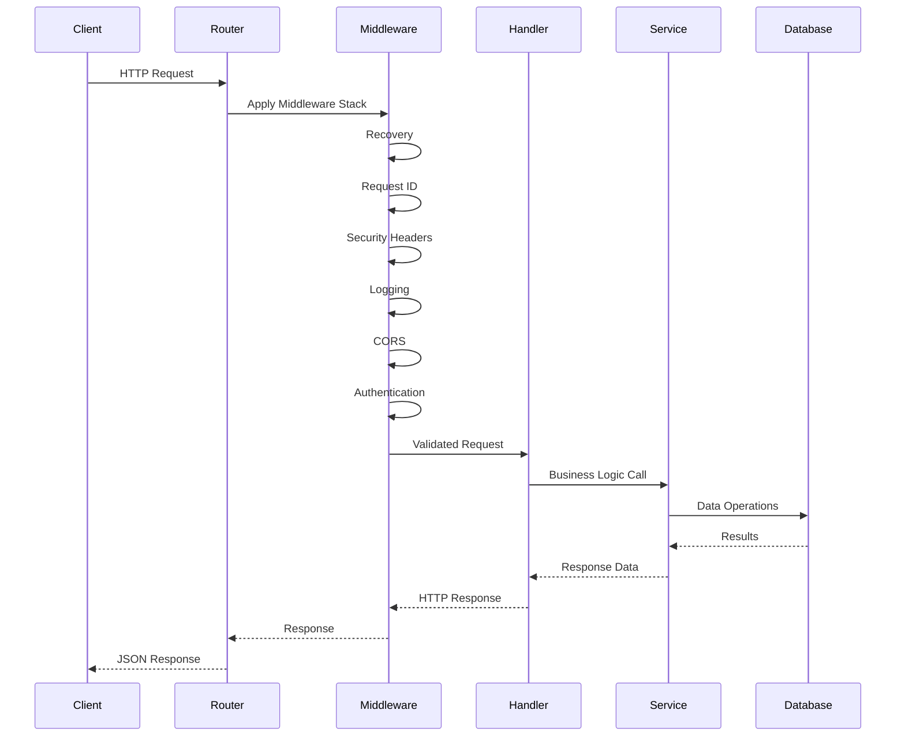
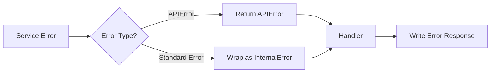

# 🔧 Backend Architecture

<div align="center">

**Go Backend Services and Design Patterns**

[← Overview](overview.md) • [Frontend →](frontend.md) • [Database →](database.md)

</div>

---

## 📋 Table of Contents

- [Overview](#overview)
- [Project Structure](#project-structure)
- [Core Components](#core-components)
- [Service Layer](#service-layer)
- [Handler Layer](#handler-layer)
- [Middleware](#middleware)
- [Database Layer](#database-layer)
- [Design Patterns](#design-patterns)
- [Error Handling](#error-handling)
- [Configuration](#configuration)

---

## 🎯 Overview

The NeuronIP backend is built with **Go 1.24+** and follows clean architecture principles with clear separation of concerns:

```
api/
├── cmd/
│   └── server/
│       └── main.go          # Application entry point
├── internal/
│   ├── handlers/            # HTTP handlers
│   ├── services/           # Business logic
│   ├── db/                 # Database layer
│   ├── middleware/         # HTTP middleware
│   ├── config/             # Configuration
│   └── ...                 # Other packages
└── migrations/              # Database migrations
```

---

## 📁 Project Structure

### Directory Layout

```mermaid
graph TD
    A[api/] --> B[cmd/server/]
    A --> C[internal/]
    A --> D[migrations/]
    
    B --> E[main.go]
    
    C --> F[handlers/]
    C --> G[agent/]
    C --> H[agents/]
    C --> I[alerts/]
    C --> J[analytics/]
    C --> K[auth/]
    C --> L[billing/]
    C --> M[catalog/]
    C --> N[compliance/]
    C --> O[config/]
    C --> P[datasources/]
    C --> Q[db/]
    C --> R[email/]
    C --> S[errors/]
    C --> T[handlers/]
    C --> U[integrations/]
    C --> V[knowledgegraph/]
    C --> W[lineage/]
    C --> X[logging/]
    C --> Y[mcp/]
    C --> Z[metrics/]
    C --> AA[middleware/]
    C --> AB[models/]
    C --> AC[neurondb/]
    C --> AD[observability/]
    C --> AE[semantic/]
    C --> AF[support/]
    C --> AG[users/]
    C --> AH[versioning/]
    C --> AI[warehouse/]
    C --> AJ[workflows/]
```



### Package Organization

| Package | Responsibility |
|---------|---------------|
| `cmd/server` | Application entry point and server setup |
| `internal/handlers` | HTTP request/response handling |
| `internal/services` | Business logic and domain services |
| `internal/db` | Database models, queries, and connection pooling |
| `internal/middleware` | HTTP middleware (auth, logging, CORS, etc.) |
| `internal/config` | Configuration loading and validation |
| `internal/errors` | Error types and handling |
| `internal/logging` | Structured logging |
| `internal/metrics` | Prometheus metrics |

---

## 🧩 Core Components

### 1. Server Initialization

The main server setup in `cmd/server/main.go`:

```go
func main() {
    // Load configuration
    cfg := config.Load()
    
    // Initialize logging
    logging.InitLogger(...)
    
    // Create database pool
    pool, err := db.NewPool(ctx, cfg.Database)
    
    // Initialize services
    semanticService := semantic.NewService(...)
    
    // Setup router and middleware
    router := mux.NewRouter()
    router.Use(middleware.Recovery)
    router.Use(middleware.RequestID)
    // ... more middleware
    
    // Register routes
    apiRouter := router.PathPrefix("/api/v1").Subrouter()
    apiRouter.HandleFunc("/semantic/search", ...)
    
    // Start server
    server := &http.Server{...}
    server.ListenAndServe()
}
```

### 2. Request Flow



---

## 🔌 Service Layer

### Service Interface Pattern

Services implement interfaces for testability:

```go
type SemanticService interface {
    Search(ctx context.Context, req SearchRequest) ([]SearchResult, error)
    CreateDocument(ctx context.Context, doc *Document) error
    RAG(ctx context.Context, req RAGRequest) (*RAGResult, error)
}

type Service struct {
    queries      *db.Queries
    pool         *pgxpool.Pool
    neurondb     *neurondb.Client
}

func NewService(queries *db.Queries, pool *pgxpool.Pool, neurondb *neurondb.Client) *Service {
    return &Service{
        queries: queries,
        pool: pool,
        neurondb: neurondb,
    }
}
```

### Service Examples

#### Semantic Service

```go
// Semantic search service
type Service struct {
    queries  *db.Queries
    pool     *pgxpool.Pool
    neurondb *neurondb.Client
}

func (s *Service) Search(ctx context.Context, req SearchRequest) ([]SearchResult, error) {
    // 1. Generate embedding for query
    embedding, err := s.neurondb.GenerateEmbedding(ctx, req.Query)
    
    // 2. Search similar documents
    results, err := s.neurondb.VectorSearch(ctx, embedding, req.Limit)
    
    // 3. Return results
    return results, nil
}
```

#### Warehouse Service

```go
// Warehouse Q&A service
type Service struct {
    pool        *pgxpool.Pool
    agentClient *agent.Client
    neurondb    *neurondb.Client
}

func (s *Service) Query(ctx context.Context, req QueryRequest) (*QueryResult, error) {
    // 1. Convert natural language to SQL
    sql, err := s.agentClient.GenerateSQL(ctx, req.Query, req.SchemaID)
    
    // 2. Execute query
    results, err := s.pool.Query(ctx, sql)
    
    // 3. Generate explanation
    explanation, err := s.agentClient.ExplainQuery(ctx, sql, results)
    
    return &QueryResult{
        SQL: sql,
        Results: results,
        Explanation: explanation,
    }, nil
}
```

---

## 🎯 Handler Layer

### Handler Structure

Handlers are thin HTTP adapters that delegate to services:

```go
type SemanticHandler struct {
    service *semantic.Service
}

func NewSemanticHandler(service *semantic.Service) *SemanticHandler {
    return &SemanticHandler{service: service}
}

func (h *SemanticHandler) Search(w http.ResponseWriter, r *http.Request) {
    // 1. Parse request
    var req SearchRequest
    if err := json.NewDecoder(r.Body).Decode(&req); err != nil {
        WriteErrorResponse(w, errors.BadRequest("Invalid request"))
        return
    }
    
    // 2. Validate request
    if req.Query == "" {
        WriteErrorResponse(w, errors.ValidationFailed("Query required", nil))
        return
    }
    
    // 3. Call service
    results, err := h.service.Search(r.Context(), semantic.SearchRequest{
        Query: req.Query,
        Limit: req.Limit,
    })
    if err != nil {
        WriteError(w, err)
        return
    }
    
    // 4. Write response
    w.Header().Set("Content-Type", "application/json")
    json.NewEncoder(w).Encode(map[string]interface{}{
        "results": results,
        "count": len(results),
    })
}
```

### Error Handling in Handlers

```go
func WriteError(w http.ResponseWriter, err error) {
    var apiErr *errors.APIError
    if errors.IsAPIError(err) {
        apiErr = errors.AsAPIError(err)
    } else {
        apiErr = errors.InternalError(err.Error())
    }
    
    w.Header().Set("Content-Type", "application/json")
    w.WriteHeader(apiErr.StatusCode)
    json.NewEncoder(w).Encode(apiErr)
}
```

---

## 🛡️ Middleware

### Middleware Stack

Middleware is applied in order:

```go
router.Use(middleware.Recovery)        // 1. Panic recovery
router.Use(middleware.RequestID)       // 2. Request ID generation
router.Use(middleware.SecurityHeaders) // 3. Security headers
router.Use(middleware.HTTPLogging)    // 4. Request/response logging
router.Use(middleware.CORS(...))      // 5. CORS handling
router.Use(auth.Middleware(...))       // 6. Authentication (if enabled)
```

### Middleware Examples

#### Recovery Middleware

```go
func Recovery(next http.Handler) http.Handler {
    return http.HandlerFunc(func(w http.ResponseWriter, r *http.Request) {
        defer func() {
            if err := recover(); err != nil {
                logger.Error("Panic recovered", "error", err)
                WriteErrorResponse(w, errors.InternalError("Internal server error"))
            }
        }()
        next.ServeHTTP(w, r)
    })
}
```

#### Request ID Middleware

```go
func RequestID(next http.Handler) http.Handler {
    return http.HandlerFunc(func(w http.ResponseWriter, r *http.Request) {
        requestID := r.Header.Get("X-Request-ID")
        if requestID == "" {
            requestID = uuid.New().String()
        }
        
        ctx := context.WithValue(r.Context(), RequestIDKey, requestID)
        w.Header().Set("X-Request-ID", requestID)
        
        next.ServeHTTP(w, r.WithContext(ctx))
    })
}
```

#### Authentication Middleware

```go
func Middleware(queries *db.Queries) mux.MiddlewareFunc {
    return func(next http.Handler) http.Handler {
        return http.HandlerFunc(func(w http.ResponseWriter, r *http.Request) {
            // Extract API key from header
            apiKey := extractAPIKey(r)
            if apiKey == "" {
                WriteErrorResponse(w, errors.Unauthorized("API key required"))
                return
            }
            
            // Validate API key
            key, err := queries.GetAPIKeyByPrefix(r.Context(), apiKey[:8])
            if err != nil {
                WriteErrorResponse(w, errors.Unauthorized("Invalid API key"))
                return
            }
            
            // Add user to context
            ctx := context.WithValue(r.Context(), UserIDKey, key.UserID)
            next.ServeHTTP(w, r.WithContext(ctx))
        })
    }
}
```

---

## 💾 Database Layer

### Connection Pooling

```go
type Pool struct {
    Pool *pgxpool.Pool
}

func NewPool(ctx context.Context, cfg config.DatabaseConfig) (*Pool, error) {
    config, err := pgxpool.ParseConfig(cfg.DSN())
    if err != nil {
        return nil, err
    }
    
    config.MaxConns = int32(cfg.MaxOpenConns)
    config.MinConns = int32(cfg.MaxIdleConns)
    config.MaxConnLifetime = cfg.ConnMaxLifetime
    
    pool, err := pgxpool.NewWithConfig(ctx, config)
    if err != nil {
        return nil, err
    }
    
    return &Pool{Pool: pool}, nil
}
```

### Query Layer

```go
type Queries struct {
    pool *pgxpool.Pool
}

func NewQueries(pool *pgxpool.Pool) *Queries {
    return &Queries{pool: pool}
}

func (q *Queries) GetDocument(ctx context.Context, id uuid.UUID) (*db.KnowledgeDocument, error) {
    var doc db.KnowledgeDocument
    err := q.pool.QueryRow(ctx, `
        SELECT id, collection_id, title, content, content_type, 
               source, source_url, metadata, created_at, updated_at
        FROM neuronip.knowledge_documents
        WHERE id = $1
    `, id).Scan(...)
    
    return &doc, err
}
```

### Row-Level Security (RLS)

```go
// Enable RLS on tables
func EnableRLS(ctx context.Context, pool *pgxpool.Pool) error {
    _, err := pool.Exec(ctx, `
        ALTER TABLE neuronip.knowledge_documents 
        ENABLE ROW LEVEL SECURITY;
        
        CREATE POLICY document_access_policy 
        ON neuronip.knowledge_documents
        FOR ALL
        USING (created_by = current_user);
    `)
    return err
}
```

---

## 🎨 Design Patterns

### 1. Dependency Injection

Services receive dependencies through constructors:

```go
service := semantic.NewService(
    queries,      // Database queries
    pool,         // Connection pool
    neurondbClient, // External client
)
```

### 2. Repository Pattern

Database access is abstracted through query objects:

```go
queries := db.NewQueries(pool)
document, err := queries.GetDocument(ctx, id)
```

### 3. Service Layer Pattern

Business logic is encapsulated in services:

```go
type Service struct {
    // Dependencies
}

func (s *Service) BusinessMethod(ctx context.Context, input Input) (Output, error) {
    // Business logic here
}
```

### 4. Middleware Pattern

Cross-cutting concerns are handled via middleware:

```go
router.Use(middleware.Recovery)
router.Use(middleware.Logging)
```

---

## ⚠️ Error Handling

### Error Types

```go
type APIError struct {
    Code       string                 `json:"code"`
    Message    string                 `json:"message"`
    StatusCode int                    `json:"-"`
    Details    map[string]interface{} `json:"details,omitempty"`
}

// Error constructors
func BadRequest(message string) *APIError
func Unauthorized(message string) *APIError
func NotFound(resource string) *APIError
func ValidationFailed(message string, details map[string]interface{}) *APIError
func InternalError(message string) *APIError
```

### Error Handling Flow



---

## ⚙️ Configuration

### Configuration Structure

```go
type Config struct {
    Database    DatabaseConfig
    Server      ServerConfig
    Logging     LoggingConfig
    CORS        CORSConfig
    Auth        AuthConfig
    NeuronDB    NeuronDBConfig
    NeuronAgent NeuronAgentConfig
    NeuronMCP   NeuronMCPConfig
}
```

### Configuration Loading

```go
func Load() *Config {
    return &Config{
        Database: DatabaseConfig{
            Host:     getEnv("DB_HOST", "localhost"),
            Port:     getEnv("DB_PORT", "5432"),
            // ...
        },
        // ...
    }
}

func (c *Config) Validate() error {
    if c.Database.Host == "" {
        return fmt.Errorf("DB_HOST is required")
    }
    // ... more validation
    return nil
}
```

---

## 📊 Metrics and Observability

### Prometheus Metrics

```go
var (
    semanticSearches = prometheus.NewCounterVec(
        prometheus.CounterOpts{
            Name: "neuronip_semantic_searches_total",
            Help: "Total number of semantic searches",
        },
        []string{"collection_id"},
    )
    
    requestDuration = prometheus.NewHistogramVec(
        prometheus.HistogramOpts{
            Name: "neuronip_request_duration_seconds",
            Help: "Request duration in seconds",
        },
        []string{"method", "endpoint", "status"},
    )
)
```

### Structured Logging

```go
logger.Info("Request processed",
    "method", r.Method,
    "path", r.URL.Path,
    "status", statusCode,
    "duration_ms", duration,
    "request_id", requestID,
)
```

---

## 📚 Related Documentation

- [Frontend Architecture](frontend.md) - Frontend structure
- [Database Design](database.md) - Database schema
- [API Reference](../api/endpoints.md) - API endpoints
- [Development Setup](../development/setup.md) - Development environment

---

<div align="center">

[← Back to Architecture](README.md) • [Next: Frontend Architecture →](frontend.md)

</div>
