# 🔄 Data Flow Architecture

**How Data Moves Through NeuronIP**

[← Database](database.md) • [Back to Architecture](README.md)

---

## 📋 Table of Contents

- [Overview](#overview)
- [Request Flow](#request-flow)
- [Semantic Search Flow](#semantic-search-flow)
- [Warehouse Q&A Flow](#warehouse-qa-flow)
- [Support Ticket Flow](#support-ticket-flow)
- [Workflow Execution Flow](#workflow-execution-flow)
- [Data Processing Pipelines](#data-processing-pipelines)

---

## 🎯 Overview

Understanding data flow is crucial for debugging, optimization, and system design. This document describes how data moves through NeuronIP's various components.

---

## 📥 Request Flow

### Standard API Request Flow

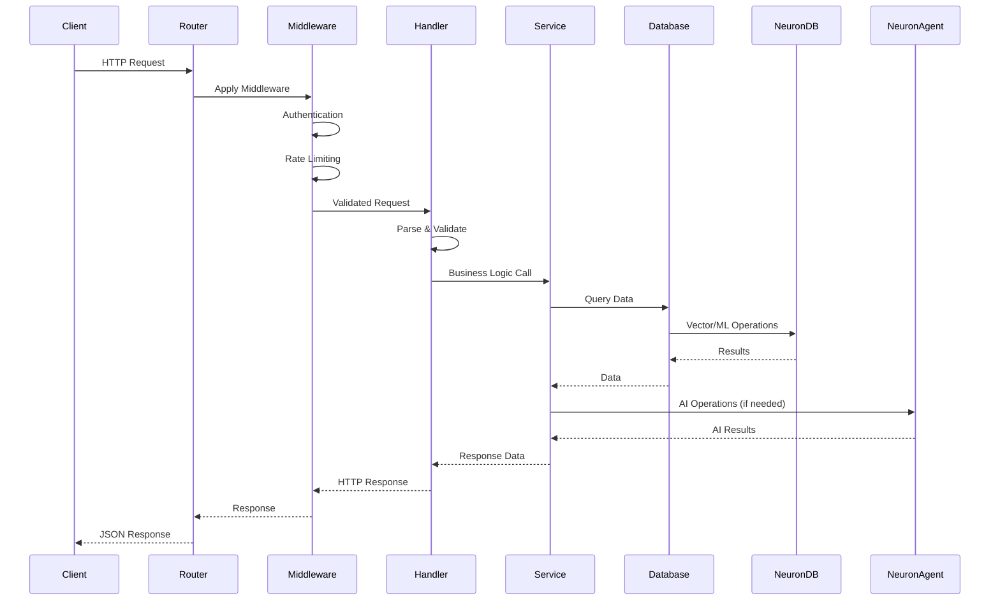

### Request Processing Steps

1. **Client Request** - HTTP request arrives at router
2. **Middleware Stack** - Authentication, logging, CORS, rate limiting
3. **Handler** - Request parsing and validation
4. **Service** - Business logic execution
5. **Database** - Data retrieval/storage
6. **NeuronDB** - Vector/ML operations (if needed)
7. **NeuronAgent** - AI agent operations (if needed)
8. **Response** - JSON response back to client

---

## 🔍 Semantic Search Flow

### Search Request Flow

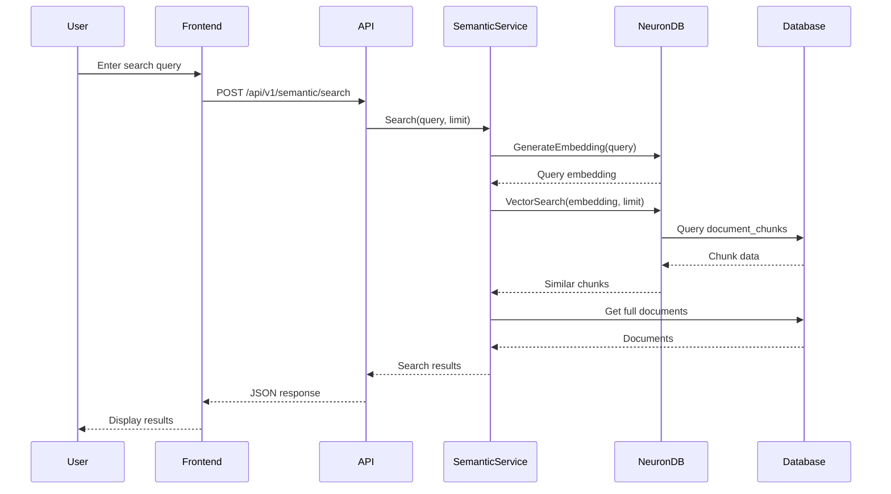

### Document Creation Flow

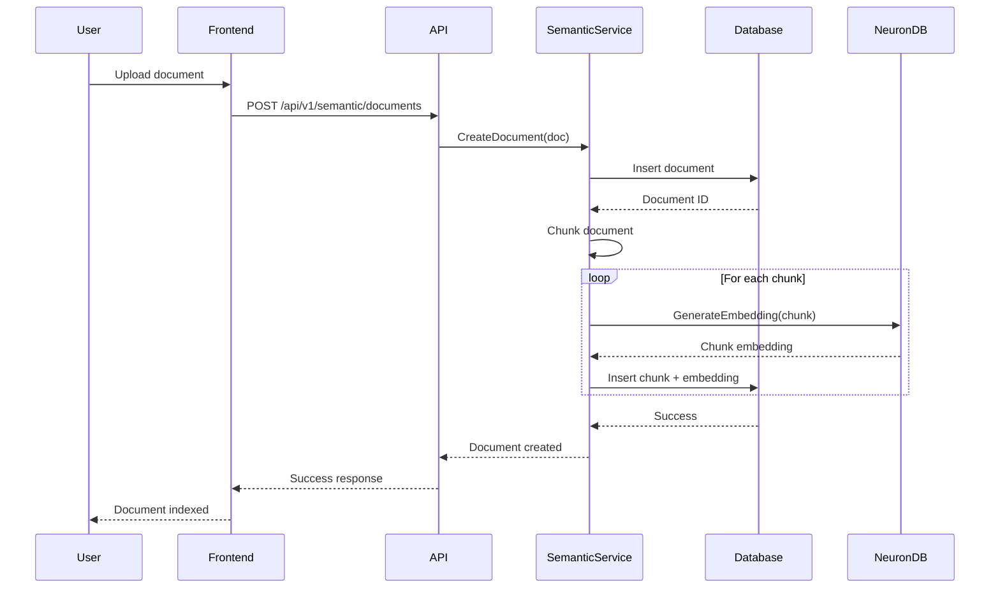

---

## 💬 Warehouse Q&A Flow

### Query Processing Flow

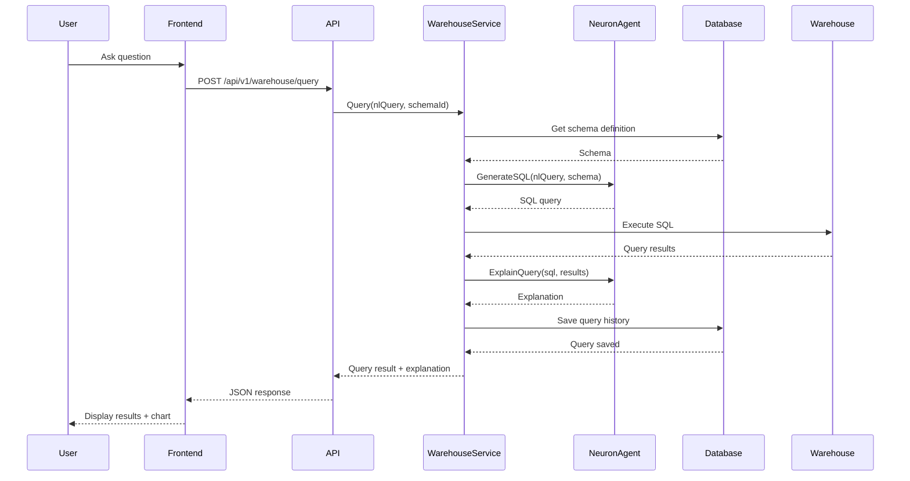

### Schema Discovery Flow

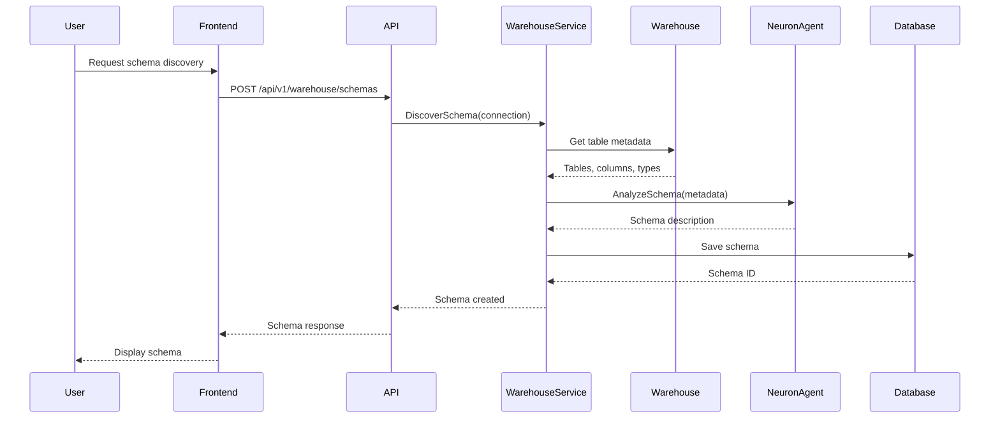

---

## 🎫 Support Ticket Flow

### Ticket Creation Flow

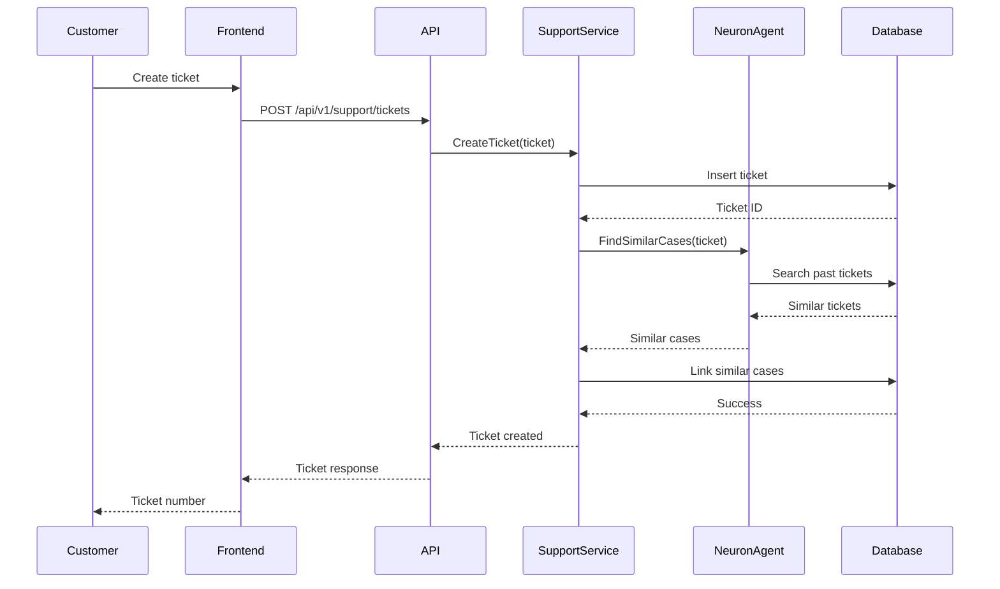

### Conversation Flow

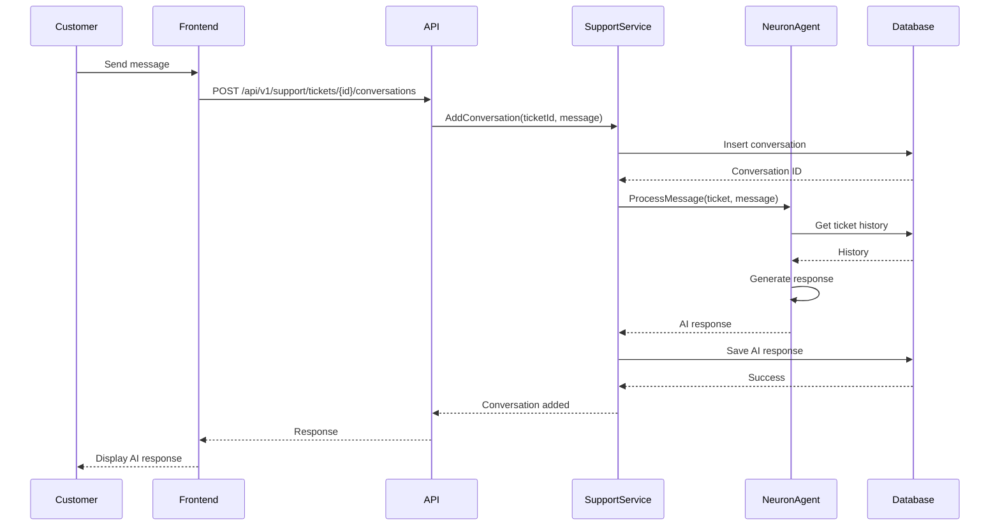

---

## ⚙️ Workflow Execution Flow

### Workflow Execution

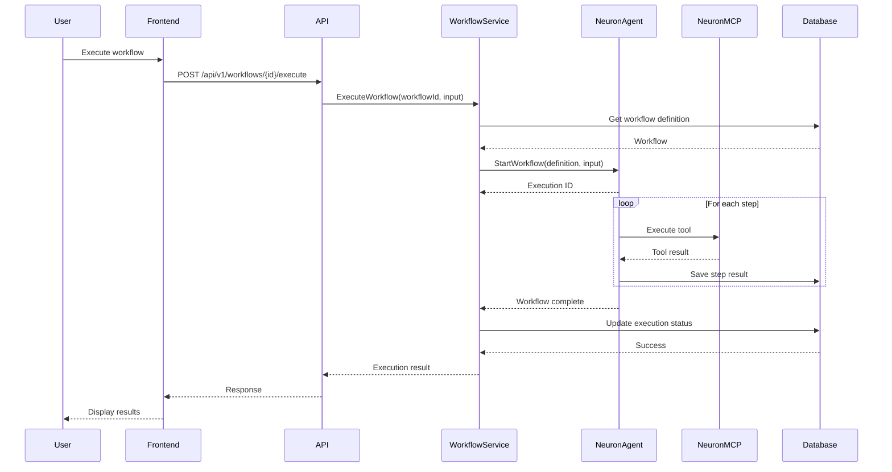

---

## 🔄 Data Processing Pipelines

### Document Indexing Pipeline

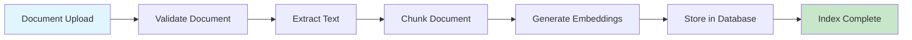

### Query Processing Pipeline

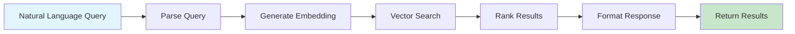

### Compliance Check Pipeline

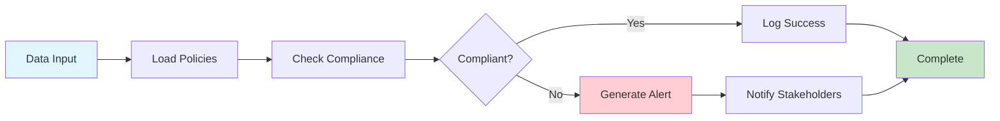

---

## 📊 Data Transformation

### Embedding Generation

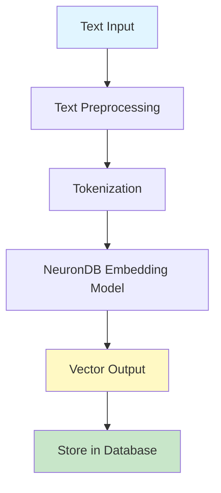

### SQL Generation

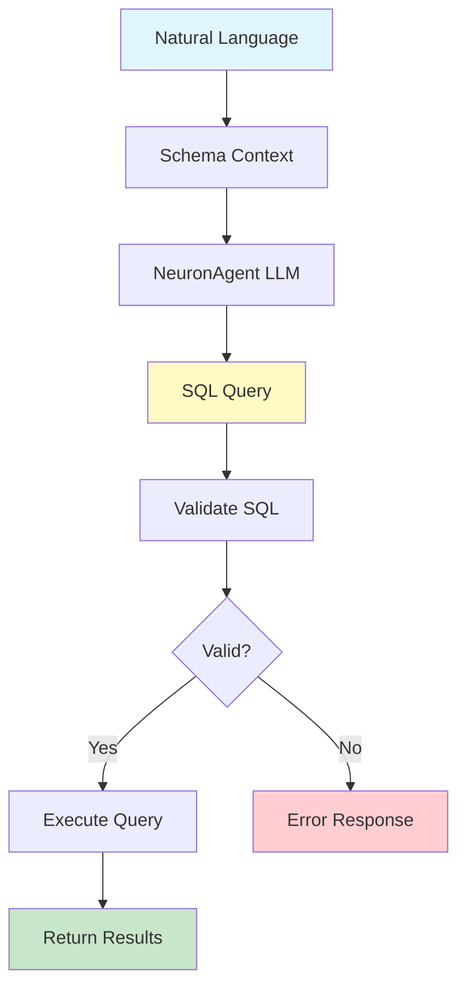

---

## 🔐 Security Flow

### Authentication Flow

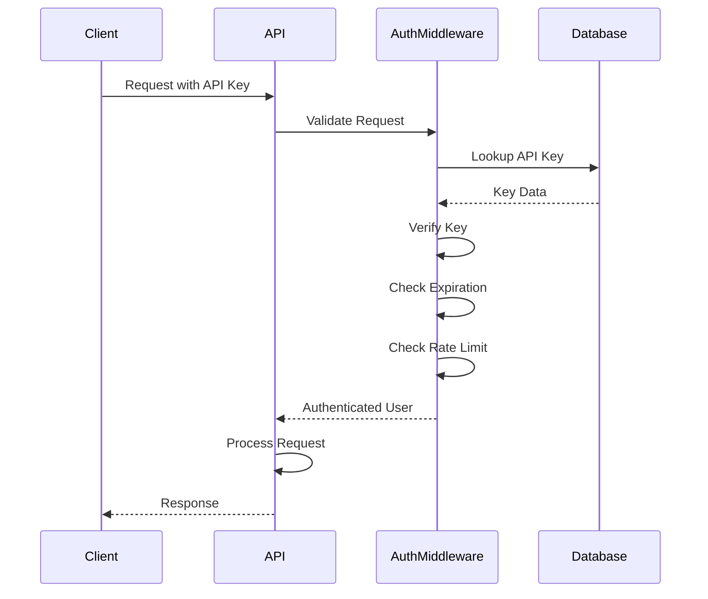

---

## 📈 Performance Optimization

### Caching Flow

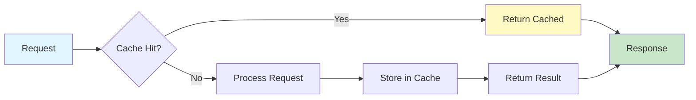

### Connection Pooling

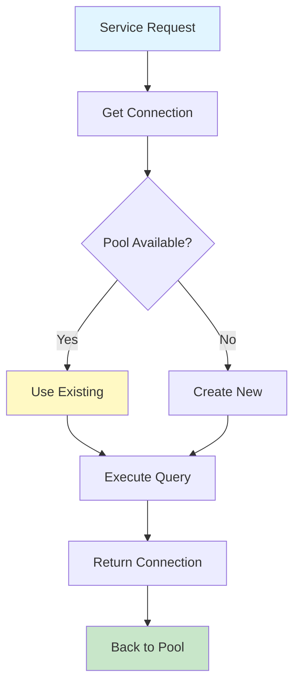

---

## 📚 Related Documentation

- [Backend Architecture](backend.md) - Backend services
- [Database Design](database.md) - Database schema
- [API Reference](../api/endpoints.md) - API endpoints

---

[← Back to Architecture](README.md)

