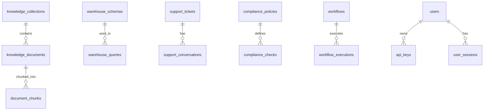
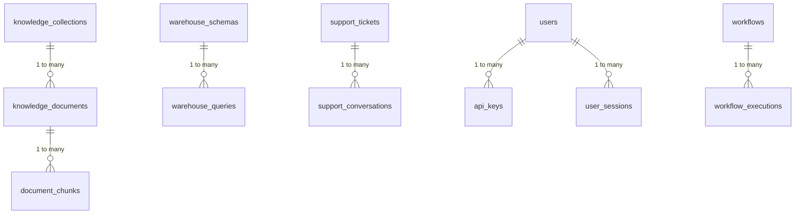

# 💾 Database Architecture

<div align="center">

**PostgreSQL Schema and Data Modeling**

[← Frontend](frontend.md) • [Data Flow →](data-flow.md)

</div>

---

## 📋 Table of Contents

- [Overview](#overview)
- [Database Schema](#database-schema)
- [Core Tables](#core-tables)
- [Relationships](#relationships)
- [Indexes](#indexes)
- [Extensions](#extensions)
- [Row-Level Security](#row-level-security)
- [Migrations](#migrations)

---

## 🎯 Overview

NeuronIP uses **PostgreSQL 16+** with the **NeuronDB extension** for AI-native capabilities.

### Key Features

- 🗄️ **PostgreSQL 16+** - Modern relational database
- 🧠 **NeuronDB Extension** - AI-native vector operations
- 🔒 **Row-Level Security (RLS)** - Data isolation
- 📊 **JSONB Support** - Flexible metadata storage
- 🔐 **Encryption** - pgcrypto for sensitive data
- 🆔 **UUID Primary Keys** - Distributed-friendly IDs

---

## 📊 Database Schema

### Schema Organization



### Schema Structure

```
neuronip schema
├── knowledge_collections
├── knowledge_documents
├── document_chunks
├── warehouse_schemas
├── warehouse_queries
├── support_tickets
├── support_conversations
├── compliance_policies
├── compliance_checks
├── workflows
├── workflow_executions
├── users
├── user_profiles
├── user_sessions
├── api_keys
└── ...
```

---

## 📋 Core Tables

### Knowledge Management

#### `knowledge_collections`

Stores knowledge collections for organizing documents.

```sql
CREATE TABLE neuronip.knowledge_collections (
    id UUID PRIMARY KEY DEFAULT uuid_generate_v4(),
    name VARCHAR(255) NOT NULL,
    description TEXT,
    created_by VARCHAR(255),
    created_at TIMESTAMP NOT NULL DEFAULT NOW(),
    updated_at TIMESTAMP NOT NULL DEFAULT NOW(),
    metadata JSONB
);

CREATE INDEX idx_collections_created_by 
    ON neuronip.knowledge_collections(created_by);
CREATE INDEX idx_collections_created_at 
    ON neuronip.knowledge_collections(created_at);
```

#### `knowledge_documents`

Stores knowledge documents with content and metadata.

```sql
CREATE TABLE neuronip.knowledge_documents (
    id UUID PRIMARY KEY DEFAULT uuid_generate_v4(),
    collection_id UUID REFERENCES neuronip.knowledge_collections(id),
    title VARCHAR(500) NOT NULL,
    content TEXT NOT NULL,
    content_type VARCHAR(100) DEFAULT 'document',
    source VARCHAR(255),
    source_url TEXT,
    metadata JSONB,
    created_at TIMESTAMP NOT NULL DEFAULT NOW(),
    updated_at TIMESTAMP NOT NULL DEFAULT NOW()
);

CREATE INDEX idx_documents_collection 
    ON neuronip.knowledge_documents(collection_id);
CREATE INDEX idx_documents_content_type 
    ON neuronip.knowledge_documents(content_type);
CREATE INDEX idx_documents_created_at 
    ON neuronip.knowledge_documents(created_at);
```

#### `document_chunks`

Stores document chunks for semantic search.

```sql
CREATE TABLE neuronip.document_chunks (
    id UUID PRIMARY KEY DEFAULT uuid_generate_v4(),
    document_id UUID NOT NULL REFERENCES neuronip.knowledge_documents(id) ON DELETE CASCADE,
    chunk_index INTEGER NOT NULL,
    content TEXT NOT NULL,
    embedding VECTOR(1536),  -- NeuronDB vector type
    metadata JSONB,
    created_at TIMESTAMP NOT NULL DEFAULT NOW()
);

CREATE INDEX idx_chunks_document 
    ON neuronip.document_chunks(document_id);
CREATE INDEX idx_chunks_embedding 
    ON neuronip.document_chunks 
    USING ivfflat (embedding vector_cosine_ops);
```

### Warehouse Q&A

#### `warehouse_schemas`

Stores data warehouse schema definitions.

```sql
CREATE TABLE neuronip.warehouse_schemas (
    id UUID PRIMARY KEY DEFAULT uuid_generate_v4(),
    name VARCHAR(255) NOT NULL,
    description TEXT,
    schema_definition JSONB NOT NULL,
    created_by VARCHAR(255),
    created_at TIMESTAMP NOT NULL DEFAULT NOW(),
    updated_at TIMESTAMP NOT NULL DEFAULT NOW()
);
```

#### `warehouse_queries`

Stores warehouse query history.

```sql
CREATE TABLE neuronip.warehouse_queries (
    id UUID PRIMARY KEY DEFAULT uuid_generate_v4(),
    user_id VARCHAR(255),
    natural_language_query TEXT NOT NULL,
    generated_sql TEXT,
    schema_id UUID REFERENCES neuronip.warehouse_schemas(id),
    status VARCHAR(50) NOT NULL,
    error_message TEXT,
    created_at TIMESTAMP NOT NULL DEFAULT NOW(),
    executed_at TIMESTAMP
);

CREATE INDEX idx_queries_user 
    ON neuronip.warehouse_queries(user_id);
CREATE INDEX idx_queries_schema 
    ON neuronip.warehouse_queries(schema_id);
CREATE INDEX idx_queries_status 
    ON neuronip.warehouse_queries(status);
```

### Support System

#### `support_tickets`

Stores customer support tickets.

```sql
CREATE TABLE neuronip.support_tickets (
    id UUID PRIMARY KEY DEFAULT uuid_generate_v4(),
    ticket_number VARCHAR(50) UNIQUE NOT NULL,
    customer_id VARCHAR(255) NOT NULL,
    customer_email VARCHAR(255),
    subject VARCHAR(500) NOT NULL,
    status VARCHAR(50) NOT NULL DEFAULT 'open',
    priority VARCHAR(20) NOT NULL DEFAULT 'medium',
    assigned_agent_id UUID,
    metadata JSONB,
    created_at TIMESTAMP NOT NULL DEFAULT NOW(),
    updated_at TIMESTAMP NOT NULL DEFAULT NOW(),
    resolved_at TIMESTAMP
);

CREATE INDEX idx_tickets_customer 
    ON neuronip.support_tickets(customer_id);
CREATE INDEX idx_tickets_status 
    ON neuronip.support_tickets(status);
CREATE INDEX idx_tickets_priority 
    ON neuronip.support_tickets(priority);
```

### Compliance

#### `compliance_policies`

Stores compliance policies.

```sql
CREATE TABLE neuronip.compliance_policies (
    id UUID PRIMARY KEY DEFAULT uuid_generate_v4(),
    policy_name VARCHAR(255) NOT NULL,
    policy_type VARCHAR(100) NOT NULL,
    description TEXT,
    policy_text TEXT NOT NULL,
    rules JSONB,
    enabled BOOLEAN NOT NULL DEFAULT true,
    created_at TIMESTAMP NOT NULL DEFAULT NOW(),
    updated_at TIMESTAMP NOT NULL DEFAULT NOW()
);
```

### Workflows

#### `workflows`

Stores workflow definitions.

```sql
CREATE TABLE neuronip.workflows (
    id UUID PRIMARY KEY DEFAULT uuid_generate_v4(),
    name VARCHAR(255) NOT NULL,
    description TEXT,
    workflow_definition JSONB NOT NULL,
    agent_id UUID,
    enabled BOOLEAN NOT NULL DEFAULT true,
    created_by VARCHAR(255),
    created_at TIMESTAMP NOT NULL DEFAULT NOW(),
    updated_at TIMESTAMP NOT NULL DEFAULT NOW()
);
```

### Authentication

#### `users`

Stores user accounts.

```sql
CREATE TABLE neuronip.users (
    id UUID PRIMARY KEY DEFAULT uuid_generate_v4(),
    email VARCHAR(255) UNIQUE NOT NULL,
    email_verified BOOLEAN NOT NULL DEFAULT false,
    password_hash TEXT,
    name VARCHAR(255),
    avatar_url TEXT,
    role VARCHAR(50) NOT NULL DEFAULT 'user',
    two_factor_enabled BOOLEAN NOT NULL DEFAULT false,
    two_factor_secret TEXT,
    preferences JSONB,
    last_login_at TIMESTAMP,
    created_at TIMESTAMP NOT NULL DEFAULT NOW(),
    updated_at TIMESTAMP NOT NULL DEFAULT NOW()
);

CREATE INDEX idx_users_email 
    ON neuronip.users(email);
CREATE INDEX idx_users_role 
    ON neuronip.users(role);
```

#### `api_keys`

Stores API keys for authentication.

```sql
CREATE TABLE neuronip.api_keys (
    id UUID PRIMARY KEY DEFAULT uuid_generate_v4(),
    key_hash TEXT NOT NULL,
    key_prefix VARCHAR(8) NOT NULL UNIQUE,
    user_id VARCHAR(255),
    name VARCHAR(255),
    rate_limit INTEGER NOT NULL DEFAULT 1000,
    last_used_at TIMESTAMP,
    expires_at TIMESTAMP,
    created_at TIMESTAMP NOT NULL DEFAULT NOW()
);

CREATE INDEX idx_api_keys_prefix 
    ON neuronip.api_keys(key_prefix);
CREATE INDEX idx_api_keys_user 
    ON neuronip.api_keys(user_id);
```

---

## 🔗 Relationships

### Entity Relationship Diagram



### Foreign Key Constraints

```sql
-- Document chunks reference documents
ALTER TABLE neuronip.document_chunks
    ADD CONSTRAINT fk_document_chunks_document
    FOREIGN KEY (document_id)
    REFERENCES neuronip.knowledge_documents(id)
    ON DELETE CASCADE;

-- Warehouse queries reference schemas
ALTER TABLE neuronip.warehouse_queries
    ADD CONSTRAINT fk_queries_schema
    FOREIGN KEY (schema_id)
    REFERENCES neuronip.warehouse_schemas(id)
    ON DELETE SET NULL;
```

---

## 📇 Indexes

### Performance Indexes

```sql
-- Semantic search indexes
CREATE INDEX idx_chunks_embedding_vector 
    ON neuronip.document_chunks 
    USING ivfflat (embedding vector_cosine_ops)
    WITH (lists = 100);

-- Full-text search indexes
CREATE INDEX idx_documents_content_fts 
    ON neuronip.knowledge_documents 
    USING gin(to_tsvector('english', content));

-- Composite indexes
CREATE INDEX idx_documents_collection_type 
    ON neuronip.knowledge_documents(collection_id, content_type);
```

### Index Strategy

| Table | Index Type | Purpose |
|-------|-----------|---------|
| `document_chunks` | Vector (IVFFlat) | Fast vector similarity search |
| `knowledge_documents` | GIN (Full-text) | Text search |
| `warehouse_queries` | B-tree | Query filtering |
| `support_tickets` | B-tree | Status/priority filtering |
| `api_keys` | Hash | Fast key lookup |

---

## 🔌 Extensions

### Required Extensions

```sql
-- NeuronDB extension for AI capabilities
CREATE EXTENSION IF NOT EXISTS neurondb;

-- UUID generation
CREATE EXTENSION IF NOT EXISTS "uuid-ossp";

-- Encryption
CREATE EXTENSION IF NOT EXISTS pgcrypto;

-- Full-text search (built-in)
-- No explicit CREATE needed
```

### NeuronDB Features

- **Vector Operations** - Semantic search with embeddings
- **ML Functions** - Machine learning inference
- **RAG Tools** - Retrieval-augmented generation

---

## 🔒 Row-Level Security

### RLS Policies

```sql
-- Enable RLS on documents
ALTER TABLE neuronip.knowledge_documents 
    ENABLE ROW LEVEL SECURITY;

-- Policy: Users can only see their own documents
CREATE POLICY document_access_policy 
    ON neuronip.knowledge_documents
    FOR ALL
    USING (created_by = current_user);

-- Policy: Admins can see all documents
CREATE POLICY document_admin_policy 
    ON neuronip.knowledge_documents
    FOR ALL
    TO admin_role
    USING (true);
```

### Security Model

- **User Isolation** - Users can only access their own data
- **Role-Based Access** - Admins have broader access
- **API Key Scoping** - API keys inherit user permissions

---

## 🔄 Migrations

### Migration Structure

```
migrations/
├── 001_users_schema.sql
├── 002_knowledge_schema.sql
├── 003_warehouse_schema.sql
└── ...
```

### Running Migrations

```bash
# Apply all migrations
psql -d neuronip -f migrations/001_users_schema.sql
psql -d neuronip -f migrations/002_knowledge_schema.sql
```

### Migration Best Practices

1. **Idempotent** - Can run multiple times safely
2. **Versioned** - Sequential numbering
3. **Reversible** - Include rollback scripts
4. **Tested** - Test on staging first

---

## 📊 Data Types

### Common Types

| Type | Usage | Example |
|------|-------|---------|
| `UUID` | Primary keys | `id UUID PRIMARY KEY` |
| `VARCHAR(n)` | Short text | `name VARCHAR(255)` |
| `TEXT` | Long text | `content TEXT` |
| `JSONB` | Structured data | `metadata JSONB` |
| `VECTOR(n)` | Embeddings | `embedding VECTOR(1536)` |
| `TIMESTAMP` | Dates/times | `created_at TIMESTAMP` |
| `BOOLEAN` | Flags | `enabled BOOLEAN` |

---

## 🔍 Query Optimization

### Query Patterns

```sql
-- Efficient semantic search
SELECT 
    d.id,
    d.title,
    d.content,
    1 - (c.embedding <=> $1::vector) AS similarity
FROM neuronip.document_chunks c
JOIN neuronip.knowledge_documents d ON c.document_id = d.id
WHERE c.embedding <=> $1::vector < 0.8
ORDER BY similarity DESC
LIMIT 10;

-- Efficient filtering with indexes
SELECT * FROM neuronip.support_tickets
WHERE status = 'open' 
  AND priority = 'high'
ORDER BY created_at DESC
LIMIT 20;
```

---

## 📚 Related Documentation

- [Backend Architecture](backend.md) - Backend services
- [Data Flow](data-flow.md) - Data processing flows
- [Database Schema Reference](../reference/database-schema.md) - Complete schema

---

<div align="center">

[← Back to Architecture](README.md) • [Next: Data Flow →](data-flow.md)

</div>
