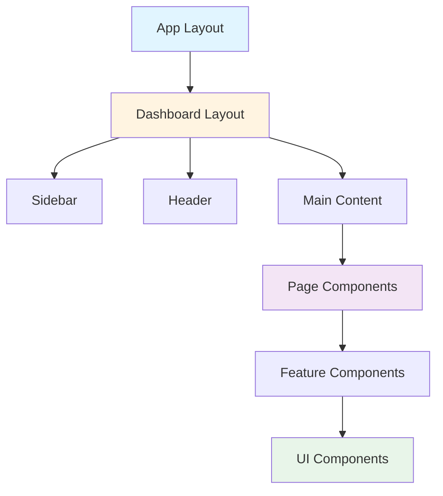

# 🎨 Frontend Architecture

<div align="center">

**Next.js Frontend Structure and Components**

[← Backend](backend.md) • [Database →](database.md) • [Data Flow →](data-flow.md)

</div>

---

## 📋 Table of Contents

- [Overview](#overview)
- [Project Structure](#project-structure)
- [Technology Stack](#technology-stack)
- [Component Architecture](#component-architecture)
- [Routing](#routing)
- [State Management](#state-management)
- [API Integration](#api-integration)
- [Styling](#styling)
- [Build and Deployment](#build-and-deployment)

---

## 🎯 Overview

The NeuronIP frontend is built with **Next.js 14** and **TypeScript**, following modern React patterns and best practices.

### Key Features

- ⚡ **Server-Side Rendering (SSR)** - Fast initial page loads
- 🔄 **Static Site Generation (SSG)** - Pre-rendered pages
- 📱 **Responsive Design** - Mobile-first approach
- 🎨 **Modern UI** - Tailwind CSS with custom components
- 🔌 **API Integration** - React Query for data fetching
- 🛡️ **Type Safety** - Full TypeScript coverage

---

## 📁 Project Structure

```
frontend/
├── app/                      # Next.js App Router
│   ├── (dashboard)/         # Dashboard route group
│   │   ├── agents/
│   │   ├── alerts/
│   │   ├── analytics/
│   │   ├── semantic/
│   │   └── ...
│   ├── layout.tsx           # Root layout
│   ├── page.tsx             # Home page
│   └── globals.css          # Global styles
├── components/              # React components
│   ├── ui/                  # Base UI components
│   ├── layout/              # Layout components
│   ├── semantic/            # Feature components
│   └── ...
├── lib/                     # Utilities and helpers
│   ├── api/                 # API client
│   ├── hooks/               # Custom React hooks
│   ├── utils/               # Utility functions
│   └── theme.ts             # Theme configuration
├── public/                  # Static assets
└── package.json
```

---

## 🛠️ Technology Stack

| Technology | Version | Purpose |
|-----------|---------|---------|
| **Next.js** | 14+ | React framework |
| **TypeScript** | Latest | Type safety |
| **React** | 18+ | UI library |
| **Tailwind CSS** | Latest | Styling |
| **React Query** | Latest | Data fetching |
| **Zustand** | Latest | State management |
| **React Hook Form** | Latest | Form handling |
| **Recharts** | Latest | Data visualization |

---

## 🧩 Component Architecture

### Component Hierarchy



### Component Types

#### 1. Layout Components

Located in `components/layout/`:

- `DashboardLayout.tsx` - Main dashboard layout
- `Header.tsx` - Top navigation bar
- `Sidebar.tsx` - Side navigation
- `NotificationCenter.tsx` - Notifications panel

#### 2. Feature Components

Feature-specific components:

- `components/semantic/` - Semantic search components
- `components/warehouse/` - Warehouse Q&A components
- `components/support/` - Support ticket components
- `components/compliance/` - Compliance components

#### 3. UI Components

Base UI components in `components/ui/`:

- Buttons, inputs, modals
- Cards, tables, charts
- Forms, dialogs, dropdowns

---

## 🛣️ Routing

### App Router Structure

Next.js 14 uses the App Router with file-based routing:

```
app/
├── page.tsx                 # / (home)
├── layout.tsx               # Root layout
├── (dashboard)/              # Route group
│   ├── layout.tsx           # Dashboard layout
│   ├── page.tsx             # /dashboard
│   ├── semantic/
│   │   └── page.tsx         # /semantic
│   ├── warehouse/
│   │   └── page.tsx         # /warehouse
│   └── ...
└── error.tsx                 # Error page
```

### Route Groups

Route groups `(dashboard)` allow shared layouts without affecting the URL:

```tsx
// app/(dashboard)/layout.tsx
export default function DashboardLayout({
  children,
}: {
  children: React.ReactNode
}) {
  return (
    <DashboardLayout>
      <Sidebar />
      <main>{children}</main>
    </DashboardLayout>
  )
}
```

---

## 🔄 State Management

### React Query for Server State

```tsx
// lib/hooks/useSemanticSearch.ts
import { useQuery } from '@tanstack/react-query'

export function useSemanticSearch(query: string, limit = 10) {
  return useQuery({
    queryKey: ['semantic-search', query, limit],
    queryFn: () => api.semantic.search({ query, limit }),
    enabled: !!query,
  })
}
```

### Zustand for Client State

```tsx
// lib/store/useAuthStore.ts
import create from 'zustand'

interface AuthState {
  user: User | null
  setUser: (user: User | null) => void
}

export const useAuthStore = create<AuthState>((set) => ({
  user: null,
  setUser: (user) => set({ user }),
}))
```

---

## 🔌 API Integration

### API Client

```tsx
// lib/api/client.ts
class APIClient {
  private baseURL: string
  private apiKey: string | null = null

  constructor(baseURL: string) {
    this.baseURL = baseURL
  }

  setApiKey(key: string) {
    this.apiKey = key
  }

  async request<T>(endpoint: string, options?: RequestInit): Promise<T> {
    const headers: HeadersInit = {
      'Content-Type': 'application/json',
      ...options?.headers,
    }

    if (this.apiKey) {
      headers['Authorization'] = `Bearer ${this.apiKey}`
    }

    const response = await fetch(`${this.baseURL}${endpoint}`, {
      ...options,
      headers,
    })

    if (!response.ok) {
      throw new APIError(response.status, await response.text())
    }

    return response.json()
  }

  async semanticSearch(query: string, limit = 10) {
    return this.request<SearchResponse>('/semantic/search', {
      method: 'POST',
      body: JSON.stringify({ query, limit }),
    })
  }
}
```

### React Query Integration

```tsx
// lib/api/semantic.ts
export const semanticAPI = {
  search: async (params: SearchParams) => {
    const response = await client.request<SearchResponse>(
      '/semantic/search',
      {
        method: 'POST',
        body: JSON.stringify(params),
      }
    )
    return response
  },
}
```

---

## 🎨 Styling

### Tailwind CSS

Global styles and configuration:

```tsx
// tailwind.config.js
module.exports = {
  content: [
    './app/**/*.{js,ts,jsx,tsx}',
    './components/**/*.{js,ts,jsx,tsx}',
  ],
  theme: {
    extend: {
      colors: {
        primary: {
          50: '#f0f9ff',
          // ... more colors
        },
      },
    },
  },
}
```

### Component Styling

```tsx
// components/ui/Button.tsx
export function Button({ children, variant = 'primary', ...props }) {
  return (
    <button
      className={cn(
        'px-4 py-2 rounded-lg font-medium',
        {
          'bg-primary-600 text-white': variant === 'primary',
          'bg-gray-200 text-gray-900': variant === 'secondary',
        }
      )}
      {...props}
    >
      {children}
    </button>
  )
}
```

---

## 📊 Data Visualization

### Chart Components

Using Recharts for data visualization:

```tsx
// components/charts/LineChart.tsx
import { LineChart, Line, XAxis, YAxis, CartesianGrid, Tooltip } from 'recharts'

export function LineChart({ data }) {
  return (
    <LineChart width={600} height={300} data={data}>
      <CartesianGrid strokeDasharray="3 3" />
      <XAxis dataKey="name" />
      <YAxis />
      <Tooltip />
      <Line type="monotone" dataKey="value" stroke="#8884d8" />
    </LineChart>
  )
}
```

---

## 🚀 Build and Deployment

### Development

```bash
npm run dev        # Start development server
npm run build      # Build for production
npm run start      # Start production server
npm run lint       # Run linter
```

### Production Build

```bash
# Build optimized production bundle
npm run build

# Output in .next/ directory
.next/
├── static/        # Static assets
├── server/        # Server-side code
└── ...
```

### Docker Deployment

```dockerfile
# frontend/Dockerfile
FROM node:18-alpine AS builder
WORKDIR /app
COPY package*.json ./
RUN npm ci
COPY . .
RUN npm run build

FROM node:18-alpine AS runner
WORKDIR /app
COPY --from=builder /app/.next ./.next
COPY --from=builder /app/public ./public
COPY --from=builder /app/package.json ./
RUN npm install --production
CMD ["npm", "start"]
```

---

## 🔒 Security

### API Key Management

```tsx
// Store API key securely
const apiKey = localStorage.getItem('api_key')
if (apiKey) {
  client.setApiKey(apiKey)
}
```

### Environment Variables

```bash
# .env.local
NEXT_PUBLIC_API_URL=http://localhost:8082/api/v1
```

> ⚠️ **Note**: Only variables prefixed with `NEXT_PUBLIC_` are exposed to the browser.

---

## 📚 Related Documentation

- [Backend Architecture](backend.md) - Backend services
- [API Reference](../api/endpoints.md) - API documentation
- [Development Setup](../development/setup.md) - Development environment

---

<div align="center">

[← Back to Architecture](README.md) • [Next: Database Design →](database.md)

</div>
