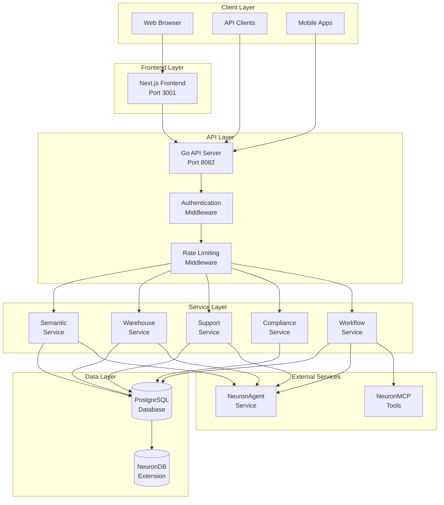
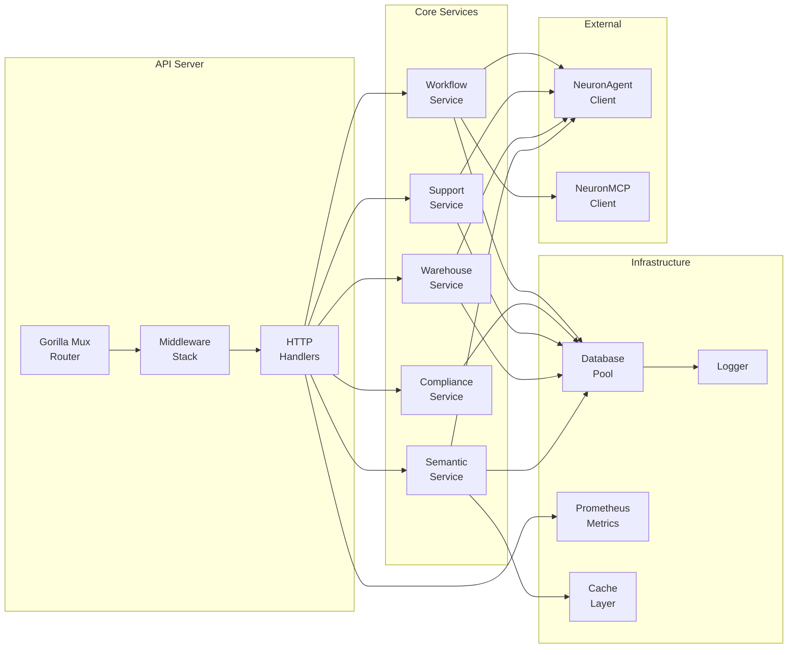
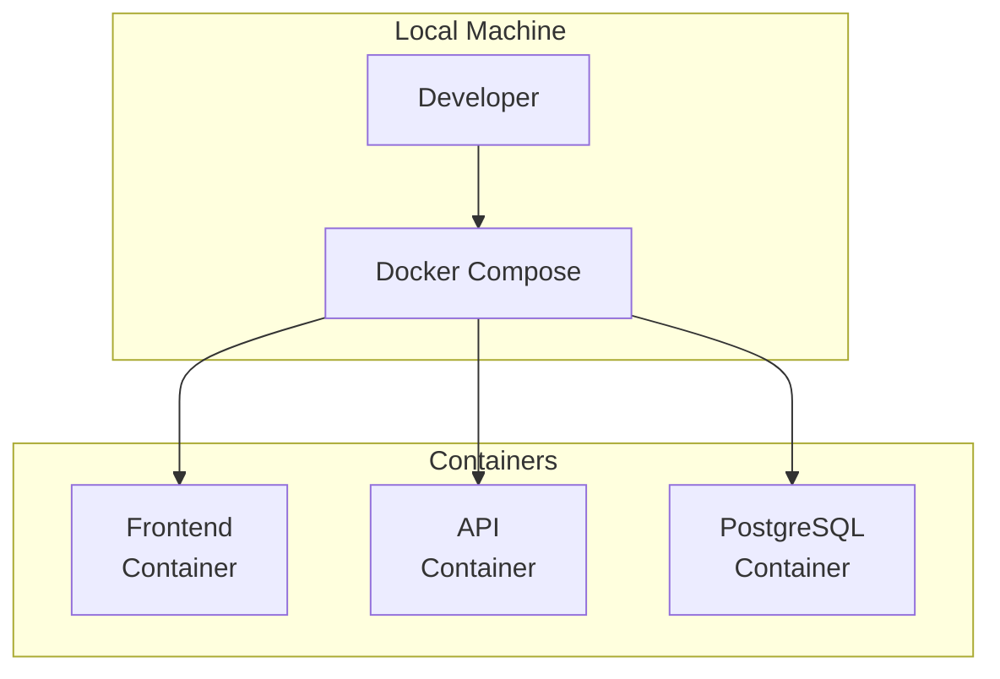
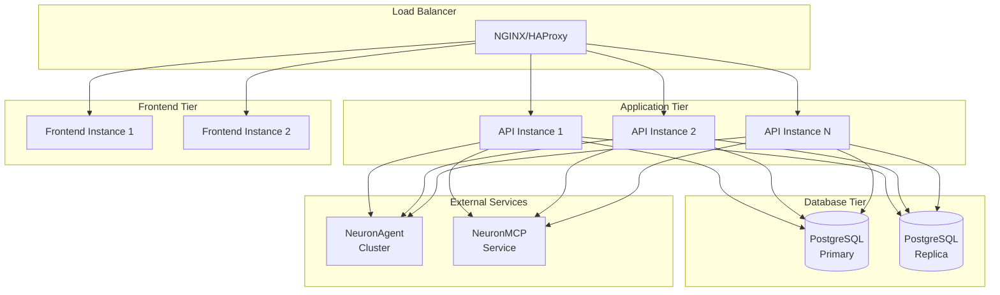
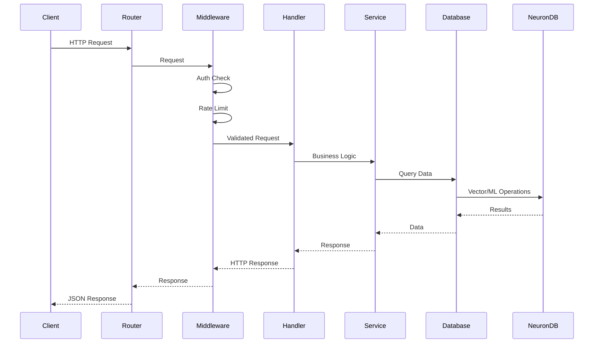
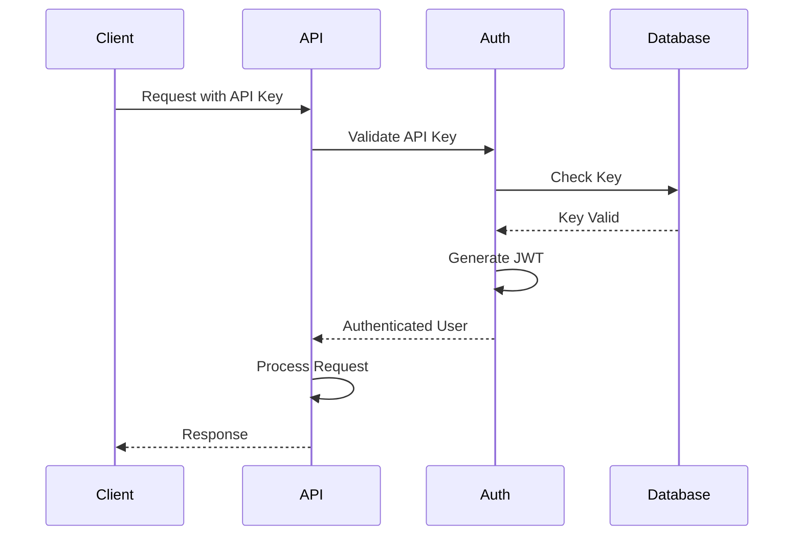

# 🏗️ System Architecture Overview

<div align="center">

**Understanding NeuronIP's Architecture**

[Backend →](backend.md) • [Frontend →](frontend.md) • [Database →](database.md) • [Data Flow →](data-flow.md)

</div>

---

## 📋 Table of Contents

- [Overview](#overview)
- [System Architecture](#system-architecture)
- [Component Diagram](#component-diagram)
- [Technology Stack](#technology-stack)
- [Design Principles](#design-principles)
- [Deployment Architecture](#deployment-architecture)
- [Integration Points](#integration-points)

---

## 🎯 Overview

NeuronIP is built as a modern, microservices-inspired architecture with clear separation of concerns. The system consists of:

1. **Backend API** - Go-based REST API server
2. **Frontend** - Next.js web application
3. **Database** - PostgreSQL with NeuronDB extension
4. **External Services** - NeuronDB, NeuronAgent, NeuronMCP

### High-Level Architecture



---

## 🧩 Component Diagram

### Detailed Component Architecture



---

## 🛠️ Technology Stack

### Backend

| Technology | Version | Purpose |
|------------|---------|---------|
| **Go** | 1.24+ | Programming language |
| **Gorilla Mux** | Latest | HTTP router |
| **pgx/v5** | Latest | PostgreSQL driver |
| **Prometheus** | Latest | Metrics collection |

### Frontend

| Technology | Version | Purpose |
|------------|---------|---------|
| **Next.js** | 14+ | React framework |
| **TypeScript** | Latest | Type safety |
| **Tailwind CSS** | Latest | Styling |
| **React Query** | Latest | Data fetching |

### Database

| Technology | Version | Purpose |
|------------|---------|---------|
| **PostgreSQL** | 16+ | Primary database |
| **NeuronDB** | Latest | AI-native extensions |
| **pgcrypto** | Latest | Encryption |
| **uuid-ossp** | Latest | UUID generation |

### Infrastructure

| Technology | Purpose |
|------------|---------|
| **Docker** | Containerization |
| **Docker Compose** | Local development |
| **Prometheus** | Metrics |
| **Grafana** | Visualization (optional) |

---

## 🎨 Design Principles

### 1. Separation of Concerns

Each layer has a distinct responsibility:

- **Handlers** - HTTP request/response handling
- **Services** - Business logic
- **Database** - Data persistence
- **External Clients** - Third-party integrations

### 2. Dependency Injection

Services receive dependencies through constructors:

```go
// Example: Service with injected dependencies
service := semantic.NewService(
    queries,      // Database queries
    pool,         // Connection pool
    neurondbClient, // NeuronDB client
)
```

### 3. Interface-Based Design

Services implement interfaces for testability:

```go
type SemanticService interface {
    Search(ctx context.Context, req SearchRequest) ([]SearchResult, error)
    CreateDocument(ctx context.Context, doc *Document) error
}
```

### 4. Error Handling

Consistent error handling across the application:

```go
// Structured errors
if err != nil {
    return nil, errors.NotFound("Document not found")
}
```

### 5. Configuration Management

Environment-based configuration with validation:

```go
cfg := config.Load()
if err := cfg.Validate(); err != nil {
    // Handle validation error
}
```

---

## 🚀 Deployment Architecture

### Development Environment



### Production Environment



---

## 🔌 Integration Points

### NeuronDB Integration

NeuronDB provides AI-native capabilities:

- **Vector Operations** - Semantic search and embeddings
- **ML Functions** - Machine learning inference
- **RAG Tools** - Retrieval-augmented generation

### NeuronAgent Integration

NeuronAgent provides AI agent capabilities:

- **Session Management** - Long-term memory
- **Workflow Execution** - Multi-step agent workflows
- **Evaluation** - Agent performance metrics

### NeuronMCP Integration

NeuronMCP provides Model Context Protocol tools:

- **Vector Tools** - Vector operations
- **Embedding Tools** - Text embeddings
- **RAG Tools** - RAG pipeline operations
- **PostgreSQL Tools** - Database operations

---

## 📊 Request Flow

### Typical API Request Flow



---

## 🔐 Security Architecture

### Authentication Flow



### Authorization Model

- **API Keys** - Service-to-service authentication
- **JWT Tokens** - User session tokens
- **RBAC** - Role-based access control
- **RLS** - Row-level security in database

---

## 📈 Scalability Considerations

### Horizontal Scaling

- **Stateless API** - API instances can scale horizontally
- **Database Pooling** - Connection pooling for efficiency
- **Caching** - Redis/Memcached for frequently accessed data
- **Load Balancing** - Distribute traffic across instances

### Vertical Scaling

- **Database Optimization** - Indexes, query optimization
- **Connection Pooling** - Efficient connection management
- **Resource Limits** - CPU and memory limits per service

---

## 🔍 Monitoring and Observability

### Metrics

- **Prometheus** - Metrics collection
- **Business Metrics** - Custom application metrics
- **System Metrics** - CPU, memory, disk usage

### Logging

- **Structured Logging** - JSON-formatted logs
- **Log Levels** - Debug, Info, Warn, Error
- **Request Tracing** - Request ID tracking

### Tracing

- **Request IDs** - Track requests across services
- **Performance Metrics** - Response time tracking
- **Error Tracking** - Error aggregation and alerting

---

## 📚 Related Documentation

- [Backend Architecture](backend.md) - Detailed backend design
- [Frontend Architecture](frontend.md) - Frontend structure
- [Database Design](database.md) - Schema and data modeling
- [Data Flow](data-flow.md) - Request/response flows
- [Deployment Guide](../deployment/production.md) - Production deployment

---

<div align="center">

[← Back to Architecture](README.md) • [Next: Backend Architecture →](backend.md)

</div>
