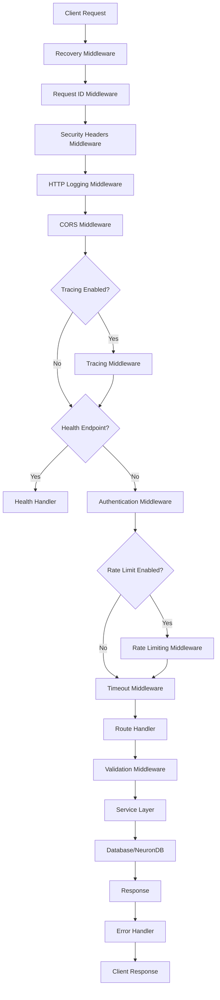

# Request/Response Flow

This document describes the complete request/response lifecycle in NeuronIP, including middleware execution order, error handling, and data flow.

## Overview

Every API request in NeuronIP goes through a well-defined pipeline of middleware and handlers. Understanding this flow is essential for debugging, performance optimization, and adding new features.

## Request Flow Diagram



## Middleware Execution Order

The middleware stack is applied in the following order (from outermost to innermost):

1. **Recovery Middleware** - Catches panics and prevents server crashes
2. **Request ID Middleware** - Generates/retrieves request ID for tracing
3. **Security Headers Middleware** - Adds security headers (CSP, HSTS, etc.)
4. **HTTP Logging Middleware** - Logs request/response details
5. **CORS Middleware** - Handles cross-origin requests
6. **Tracing Middleware** (optional) - Adds distributed tracing
7. **Authentication Middleware** - Validates API keys/JWT tokens
8. **Rate Limiting Middleware** (optional) - Enforces rate limits
9. **Timeout Middleware** - Enforces request timeouts
10. **Route Handler** - Processes the specific route
11. **Validation Middleware** (per-route) - Validates request body

## Detailed Flow

### 1. Request Reception

When a request arrives at the server:

```go
// Server receives HTTP request
server := &http.Server{
    Handler: router, // Gorilla Mux router
}
```

### 2. Global Middleware Stack

All requests pass through global middleware:

```go
router.Use(middleware.Recovery)        // 1. Panic recovery
router.Use(middleware.RequestID)       // 2. Request ID
router.Use(middleware.SecurityHeaders) // 3. Security headers
router.Use(middleware.HTTPLogging)     // 4. Logging
router.Use(middleware.CORS(...))       // 5. CORS
```

### 3. Route-Specific Middleware

API routes have additional middleware:

```go
apiRouter := router.PathPrefix("/api/v1").Subrouter()
apiRouter.Use(auth.Middleware(queries))              // Authentication
apiRouter.Use(middleware.RateLimit(rateLimiter))      // Rate limiting
apiRouter.Use(middleware.TimeoutByRoute(timeoutConfig)) // Timeouts
```

### 4. Handler Execution

The route handler processes the request:

```go
func (h *Handler) HandleRequest(w http.ResponseWriter, r *http.Request) {
    // 1. Parse request body
    var req Request
    if err := json.NewDecoder(r.Body).Decode(&req); err != nil {
        handlers.WriteErrorResponseWithContext(w, r, errors.BadRequest("Invalid JSON"))
        return
    }
    
    // 2. Validate (if using validation middleware)
    // Validation happens automatically if ValidateJSON middleware is used
    
    // 3. Call service layer
    result, err := h.service.Process(r.Context(), req)
    if err != nil {
        handlers.WriteErrorWithRequest(w, r, err)
        return
    }
    
    // 4. Write response
    w.Header().Set("Content-Type", "application/json")
    json.NewEncoder(w).Encode(result)
}
```

### 5. Error Handling

Errors are handled consistently:

```go
// All errors go through WriteError or WriteErrorResponse
handlers.WriteErrorWithRequest(w, r, err)
// or
handlers.WriteErrorResponseWithContext(w, r, apiErr)
```

Error responses include:
- Request ID (from context)
- Error code
- Error message
- Error details (if available)

### 6. Response

The response is sent back to the client with:
- Status code (from error or success)
- Headers (Content-Type, X-Request-ID, X-RateLimit-*, etc.)
- JSON body

## Error Flow

When an error occurs:

1. **Service Layer Error** - Service returns an error
2. **Error Conversion** - Error is converted to `APIError` if needed
3. **Context Enhancement** - Request ID and context added
4. **Response Writing** - Structured error response sent


## Timeout Handling

Different routes have different timeouts:

- **Default**: 30 seconds
- **Queries**: 5 minutes
- **Workflows**: 1 hour
- **Ingestion**: 10 minutes

Timeout middleware cancels the request context when exceeded.

## Rate Limiting

Rate limiting is applied per client (user ID, API key, or IP):

- Default: 1000 requests per hour
- Configurable via environment variables
- Headers added: `X-RateLimit-Limit`, `X-RateLimit-Remaining`, `X-RateLimit-Reset`

## Request ID Propagation

Request IDs are:
1. Generated or extracted from `X-Request-ID` header
2. Added to request context
3. Included in all logs
4. Added to error responses
5. Returned in `X-Request-ID` response header

## Best Practices

1. **Always use context-aware error handlers**:
   ```go
   handlers.WriteErrorWithRequest(w, r, err)
   ```

2. **Include request ID in logs**:
   ```go
   logger.WithContext(ctx).Info("Processing request")
   ```

3. **Use validation middleware** for request validation:
   ```go
   router.Handle("/endpoint", middleware.ValidateJSON(&Request{})(
       http.HandlerFunc(handler),
   ))
   ```

4. **Handle timeouts gracefully**:
   ```go
   ctx, cancel := context.WithTimeout(r.Context(), timeout)
   defer cancel()
   ```

5. **Return structured errors**:
   ```go
   return errors.BadRequest("Invalid input")
   ```

## Debugging

To debug request flow issues:

1. Check request ID in logs: `grep <request-id> logs/`
2. Review middleware execution order
3. Check error responses for request ID
4. Verify timeout settings match operation duration
5. Check rate limit headers in responses

## Performance Considerations

- Middleware adds ~1-5ms overhead per request
- Logging can be expensive - use appropriate log levels
- Rate limiting uses in-memory storage (consider Redis for distributed systems)
- Timeout middleware prevents resource leaks

## Related Documentation

- [Error Handling Guide](../development/error-handling.md)
- [Validation Guide](../development/validation.md)
- [Backend Architecture](./backend.md)
