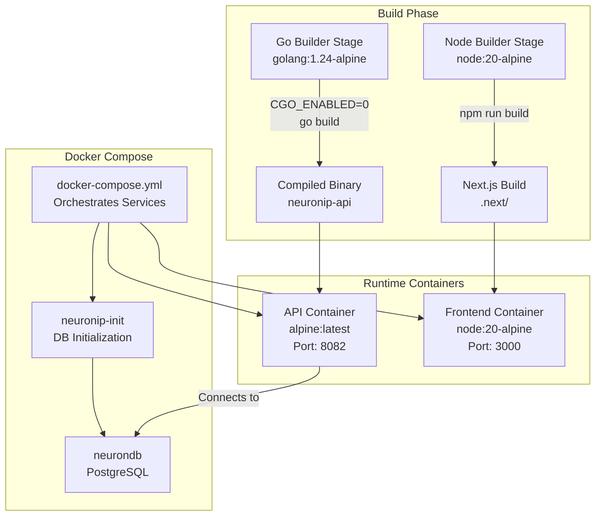
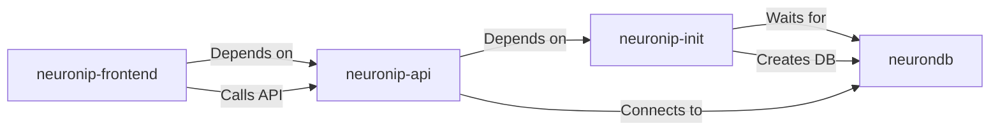

# 🐳 Docker Deployment

<div align="center">

**Deploy NeuronIP with Docker**

[Production →](production.md) • [Monitoring →](monitoring.md)

</div>

---

## 📋 Table of Contents

- [Quick Start](#quick-start)
- [Architecture Overview](#architecture-overview)
- [Container Build Strategy](#container-build-strategy)
- [Docker Compose Orchestration](#docker-compose-orchestration)
- [Build Optimizations](#build-optimizations)
- [Configuration](#configuration)
- [Production Deployment](#production-deployment)
- [Troubleshooting](#troubleshooting)

---

## 🚀 Quick Start

```bash
# Build and start all services
docker compose up -d --build

# Wait for services to be healthy (about 30-60 seconds)
docker compose ps

# Verify API is running
curl http://localhost:8082/health

# Access the application
# Frontend: http://localhost:3001
# Backend API: http://localhost:8082
```

**What you'll see:**
- 3 services starting: `neuronip-init`, `neuronip-api`, `neuronip-frontend`
- Database initialization with schema
- All services should show "healthy" status after initialization

---

## Architecture Overview

NeuronIP uses a **multi-container Docker architecture** to deliver both the Go backend API and Node.js frontend as separate, optimized containers orchestrated via Docker Compose.

> **Note**: External services (PostgreSQL, NeuronDB, NeuronMCP, NeuronAgent) are **not** included in the Docker Compose setup and must be deployed separately on different machines or containers. The NeuronIP services connect to these external services via network configuration.



### Key Components

1. **Go Backend Container** (`neuronip-api`): Statically compiled binary in minimal Alpine image
2. **Node.js Frontend Container** (`neuronip-frontend`): Next.js production build in Node.js Alpine image
3. **Database Initialization** (`neuronip-init`): One-time schema setup
4. **Orchestration**: Docker Compose manages service dependencies and networking

---

## Container Build Strategy

### 1. Go Backend Container

**Location:** [`api/Dockerfile`](../../api/Dockerfile)

**Multi-stage build pattern:**

#### Stage 1: Builder
- **Base Image:** `golang:1.24-alpine`
- **Purpose:** Compile the Go application
- **Steps:**
  1. Copy `go.mod` and `go.sum` first (for dependency caching)
  2. Download dependencies: `go mod download`
  3. Copy source code
  4. Build static binary: `CGO_ENABLED=0 GOOS=linux go build -o /app/neuronip-api ./cmd/server`
  5. Creates a statically-linked binary (no CGO dependencies)

#### Stage 2: Runtime
- **Base Image:** `alpine:latest` (minimal)
- **Purpose:** Run the compiled binary
- **Steps:**
  1. Install CA certificates for HTTPS/TLS
  2. Copy compiled binary from builder stage
  3. Expose port 8082
  4. Run binary: `./neuronip-api`

**Image Size:** ~10-15MB (vs ~300MB+ if using full golang image)

**Optimizations:**
- ✅ Layer caching: Dependencies downloaded in separate layer
- ✅ Static binary: No runtime dependencies needed
- ✅ Minimal base image: Alpine Linux reduces attack surface
- ✅ No build tools in final image: Only the binary

### 2. Node.js Frontend Container

**Location:** [`frontend/Dockerfile`](../../frontend/Dockerfile)

**Multi-stage build pattern:**

#### Stage 1: Builder
- **Base Image:** `node:20-alpine`
- **Purpose:** Build Next.js application
- **Steps:**
  1. Copy `package*.json` first (for dependency caching)
  2. Install dependencies: `npm ci` (reproducible installs)
  3. Copy source code
  4. Build application: `npm run build` (Next.js production build)
  5. Generates optimized `.next` directory with static assets

#### Stage 2: Runtime
- **Base Image:** `node:20-alpine`
- **Purpose:** Serve the Next.js application
- **Steps:**
  1. Copy production artifacts: `.next`, `public`, `package*.json`, `node_modules`
  2. Exclude development dependencies and source files
  3. Expose port 3000
  4. Start server: `npm start` (Next.js production server)

**Optimizations:**
- ✅ Dependency layer caching: `package*.json` copied separately
- ✅ Production-only artifacts: Source files not included in final image
- ✅ Development dependencies excluded from final image

---

## Docker Compose Orchestration

**Location:** [`docker-compose.yml`](../../docker-compose.yml)

The `docker-compose.yml` orchestrates three main services with proper dependency management.

### Service Dependencies



### Services

#### 1. neuronip-init
**Purpose:** One-time database initialization (for local development only)

- **Image:** `postgres:16-alpine`
- **Behavior:**
  - Waits for `neurondb` to be ready using `pg_isready`
  - Creates `neuronip` database if it doesn't exist
  - Applies schema from `neuronip.sql`
  - Runs once and exits (`restart: "no"`)

> **Production Note**: In production, PostgreSQL is deployed separately. This init container is only for local development convenience.

**Configuration:**
```yaml
depends_on:
  - neurondb
volumes:
  - ./neuronip.sql:/schema/neuronip.sql:ro
```

#### 2. neuronip-api
**Purpose:** Go backend API server

- **Build:** `./api/Dockerfile`
- **Port:** `8082:8082`
- **Dependencies:** `neuronip-init` (local dev only), external services
- **Environment Variables:**
  - Database connection: `DB_HOST`, `DB_PORT`, `DB_USER`, `DB_PASSWORD`, `DB_NAME`
    - **Production**: `DB_HOST` should point to external PostgreSQL service
  - Server: `SERVER_PORT=8082`
  - NeuronDB: `NEURONDB_HOST`, `NEURONDB_PORT`, `NEURONDB_DATABASE`
    - **Production**: Points to external NeuronDB service
  - NeuronAgent: `NEURONAGENT_ENDPOINT`
    - **Production**: Points to external NeuronAgent service

> **External Services**: In production, update environment variables to point to your external PostgreSQL, NeuronDB, and NeuronAgent services.

**Configuration:**
```yaml
build:
  context: ./api
  dockerfile: Dockerfile
depends_on:
  - neuronip-init
  - neurondb
ports:
  - "8082:8082"
restart: unless-stopped
```

#### 3. neuronip-frontend
**Purpose:** Next.js frontend application

- **Build:** `./frontend/Dockerfile`
- **Port:** `3001:3000` (host:container)
- **Dependencies:** `neuronip-api`
- **Environment Variables:**
  - `NEXT_PUBLIC_API_URL`: API endpoint URL

**Configuration:**
```yaml
build:
  context: ./frontend
  dockerfile: Dockerfile
depends_on:
  - neuronip-api
ports:
  - "3001:3000"
restart: unless-stopped
```

### Network Configuration

- **Network:** `neurondb-network` (external network)
- **Service Discovery:** Services communicate via service names
  - `neurondb` - PostgreSQL database (external service)
  - `neuronip-api` - Backend API
  - `neuronip-frontend` - Frontend application

> **Production**: External services (PostgreSQL, NeuronDB, NeuronMCP, NeuronAgent) must be accessible on the network. Update `DB_HOST`, `NEURONDB_HOST`, and `NEURONAGENT_ENDPOINT` environment variables to point to your external service endpoints.

---

## Build Optimizations

### .dockerignore Files

Both containers use `.dockerignore` to exclude unnecessary files from build context:

#### Backend Exclusions ([`api/.dockerignore`](../../api/.dockerignore))
- Test files: `*_test.go`, `testdata/`
- Build artifacts: `*.exe`, `*.dll`, `*.so`, `*.o`, `*.a`
- IDE files: `.vscode/`, `.idea/`, `*.swp`
- Documentation: `*.md`, `docs/`
- CI/CD: `.github/`, `.circleci/`
- Environment: `.env`, `.env.local`
- Git: `.git/`, `.gitignore`

#### Frontend Exclusions ([`frontend/.dockerignore`](../../frontend/.dockerignore))
- Dependencies: `node_modules/` (rebuilt in container)
- Test files: `*.test.ts`, `*.test.tsx`, `__tests__/`, `e2e/`
- Build outputs: `.next/`, `out/`, `dist/`, `build/`
- IDE files: `.vscode/`, `.idea/`, `*.swp`
- Documentation: `*.md`, `docs/`
- CI/CD: `.github/`, `.circleci/`
- Environment: `.env`, `.env.local`, `.env*.local`
- Git: `.git/`, `.gitignore`

### Build Benefits

1. **Smaller Images:** Multi-stage builds reduce final image size by 90%+
   - Go backend: ~15MB vs ~300MB
   - Node.js frontend: Only production artifacts included

2. **Faster Builds:** Layer caching speeds up subsequent builds
   - Dependencies cached separately from source code
   - Only changed layers are rebuilt

3. **Security:** Minimal base images reduce attack surface
   - Alpine Linux base images
   - No build tools in runtime images
   - Only necessary files included

4. **Separation of Concerns:** Backend and frontend can scale independently
   - Different resource requirements
   - Independent deployment cycles
   - Isolated failure domains

5. **Reproducible Builds:** Same source code produces identical images
   - Deterministic dependency installation
   - Consistent build environment

---

## Configuration

### Environment Variables

#### Backend (neuronip-api)

**Database:**
- `DB_HOST` - Database host (default: neurondb)
- `DB_PORT` - Database port (default: 5432)
- `DB_USER` - Database user (default: neurondb)
- `DB_PASSWORD` - Database password
- `DB_NAME` - Database name (default: neuronip)

**Server:**
- `SERVER_PORT` - API server port (default: 8082)
- `LOG_LEVEL` - Logging level (default: info)
- `LOG_FORMAT` - Log format: json or text (default: json)

**NeuronDB Integration:**
- `NEURONDB_HOST` - NeuronDB host
- `NEURONDB_PORT` - NeuronDB port
- `NEURONDB_DATABASE` - NeuronDB database name

**NeuronAgent Integration:**
- `NEURONAGENT_ENDPOINT` - NeuronAgent API endpoint (default: http://neuronagent:8080)
- `NEURONAGENT_API_KEY` - NeuronAgent API key

#### Frontend (neuronip-frontend)

**API Configuration:**
- `NEXT_PUBLIC_API_URL` - Backend API URL (default: http://localhost:8082/api/v1)

### Using .env File

Create a `.env` file in the project root:

```bash
# Database
POSTGRES_USER=neurondb
POSTGRES_PASSWORD=your_secure_password
DB_PASSWORD=your_secure_password

# API
SERVER_PORT=8082
LOG_LEVEL=info

# Frontend
NEXT_PUBLIC_API_URL=http://localhost:8082/api/v1

# NeuronAgent
NEURONAGENT_ENDPOINT=http://neuronagent:8080
```

> [!WARNING]
> **Production Security**: Never commit `.env` files to version control. Use Docker secrets, Kubernetes secrets, or environment variable injection in your deployment platform.

---

## Production Deployment

### Docker Compose Production

For production, use environment-specific compose files:

```bash
# Production compose file
docker compose -f docker-compose.yml -f docker-compose.prod.yml up -d
```

**Production considerations:**
- Use secrets management (Docker secrets, external vault)
- Set resource limits for containers
- Configure health checks
- Use production-ready base images
- Enable logging aggregation
- Configure backup strategies

### Kubernetes Deployment

The project includes Kubernetes manifests for production deployment:

**Location:** [`k8s/deployment.yaml`](../../k8s/deployment.yaml)

**Features:**
- **API Deployment:** 3 replicas with resource limits
  - Requests: 256Mi memory, 250m CPU
  - Limits: 512Mi memory, 500m CPU
  - Health checks: Liveness and readiness probes
- **Frontend Deployment:** 2 replicas with resource limits
  - Requests: 128Mi memory, 100m CPU
  - Limits: 256Mi memory, 200m CPU
  - Health checks: Liveness and readiness probes
- **Secrets Management:** Environment variables from Kubernetes secrets
- **Service Discovery:** Internal service communication

**Deploy to Kubernetes:**
```bash
# Apply all manifests
kubectl apply -f k8s/

# Check deployment status
kubectl get deployments -n neuronip
kubectl get pods -n neuronip
```

See [Kubernetes Deployment](kubernetes.md) for detailed instructions.

---

## Troubleshooting

### Common Issues

#### Services won't start

**Problem:** Containers exit immediately or fail to start

**Solutions:**
```bash
# Check container logs
docker compose logs neuronip-api
docker compose logs neuronip-frontend

# Check if database is accessible
docker compose exec neuronip-api ping neurondb

# Verify environment variables
docker compose config
```

#### Database connection errors

**Problem:** API cannot connect to database

**Solutions:**
```bash
# Verify database is running
docker compose ps neurondb

# Check network connectivity
docker compose exec neuronip-api nc -zv neurondb 5432

# Verify credentials
docker compose exec neurondb psql -U neurondb -d neuronip -c "SELECT 1;"
```

#### Frontend cannot reach API

**Problem:** Frontend shows API connection errors

**Solutions:**
```bash
# Verify API is accessible
curl http://localhost:8082/health

# Check NEXT_PUBLIC_API_URL environment variable
docker compose exec neuronip-frontend env | grep NEXT_PUBLIC_API_URL

# Test API from frontend container
docker compose exec neuronip-frontend wget -O- http://neuronip-api:8082/health
```

#### Build failures

**Problem:** Docker build fails

**Solutions:**
```bash
# Clean build (no cache)
docker compose build --no-cache

# Check Dockerfile syntax
docker build -t test ./api
docker build -t test ./frontend

# Verify build context
docker compose config
```

#### Port conflicts

**Problem:** Ports 3001 or 8082 already in use

**Solutions:**
```bash
# Find process using port
lsof -i :8082
lsof -i :3001

# Change ports in docker-compose.yml
ports:
  - "8083:8082"  # Change host port
```

### Debugging Commands

```bash
# View all service logs
docker compose logs -f

# View specific service logs
docker compose logs -f neuronip-api

# Execute commands in containers
docker compose exec neuronip-api sh
docker compose exec neuronip-frontend sh

# Check container resource usage
docker stats

# Inspect container configuration
docker compose config

# Restart specific service
docker compose restart neuronip-api

# Rebuild and restart
docker compose up -d --build neuronip-api
```

### Health Checks

```bash
# API health check
curl http://localhost:8082/health

# Frontend health check
curl http://localhost:3001/

# Database health check
docker compose exec neurondb pg_isready -U neurondb
```

---

## External Service Configuration

### Production Deployment

In production, external services are deployed separately:

1. **PostgreSQL**: Update `DB_HOST` environment variable
2. **NeuronDB**: Update `NEURONDB_HOST` environment variable
3. **NeuronMCP**: Configure MCP service endpoint
4. **NeuronAgent**: Update `NEURONAGENT_ENDPOINT` environment variable

**Example production configuration:**
```yaml
services:
  neuronip-api:
    environment:
      DB_HOST: postgres.production.example.com
      NEURONDB_HOST: neurondb.production.example.com
      NEURONAGENT_ENDPOINT: https://neuronagent.production.example.com:8080
```

See [Production Deployment Guide](production.md) for detailed external service configuration.

---

## 📚 Related Documentation

- [Production Deployment](production.md) - Production checklist and best practices
- [Packaging Guide](packaging.md) - How images are built and packaged
- [Kubernetes Deployment](kubernetes.md) - Kubernetes deployment guide
- [Monitoring](monitoring.md) - Observability and monitoring setup
- [Configuration Reference](../../docs/reference/configuration.md) - Complete configuration options

---

<div align="center">

[← Back to Documentation](../../README.md)

</div>
