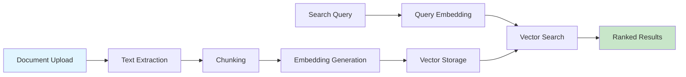

# 🔍 Semantic Knowledge Search

<div align="center">

**Search your knowledge base by meaning, not just keywords**

[Warehouse Q&A →](warehouse-qa.md) • [Support Memory →](support-memory.md)

</div>

---

## 📋 Table of Contents

- [Overview](#overview)
- [How It Works](#how-it-works)
- [Getting Started](#getting-started)
- [API Reference](#api-reference)
- [Best Practices](#best-practices)
- [Advanced Features](#advanced-features)

---

## 🎯 Overview

Semantic Knowledge Search allows you to search your knowledge base by meaning, not just exact keyword matches. Powered by vector embeddings and semantic similarity.

### Key Features

- 🔍 **Semantic Search** - Find documents by meaning
- 📄 **Document Management** - Upload and organize documents
- 🧩 **Chunking** - Automatic document chunking
- 🎯 **Collections** - Organize documents into collections
- 🔄 **RAG Pipeline** - Retrieval-Augmented Generation

---

## 🔧 How It Works

### Architecture



### Process Flow

1. **Document Upload** - Upload documents via API
2. **Chunking** - Documents are split into chunks
3. **Embedding** - Each chunk is converted to a vector embedding
4. **Storage** - Embeddings stored in PostgreSQL with NeuronDB
5. **Search** - Query is embedded and matched against document embeddings
6. **Ranking** - Results ranked by semantic similarity

---

## 🚀 Getting Started

### 1. Create a Document

```bash
curl -X POST http://localhost:8082/api/v1/semantic/documents \
  -H "Content-Type: application/json" \
  -H "Authorization: Bearer YOUR_API_KEY" \
  -d '{
    "document": {
      "title": "NeuronIP Overview",
      "content": "NeuronIP is an AI-native enterprise intelligence platform...",
      "content_type": "document"
    }
  }'
```

### 2. Search Documents

```bash
curl -X POST http://localhost:8082/api/v1/semantic/search \
  -H "Content-Type: application/json" \
  -H "Authorization: Bearer YOUR_API_KEY" \
  -d '{
    "query": "What is NeuronIP?",
    "limit": 10
  }'
```

### 3. Use RAG Pipeline

```bash
curl -X POST http://localhost:8082/api/v1/semantic/rag \
  -H "Content-Type: application/json" \
  -H "Authorization: Bearer YOUR_API_KEY" \
  -d '{
    "query": "Explain NeuronIP features",
    "limit": 5,
    "max_context": 2000
  }'
```

---

## 📡 API Reference

### Search Endpoints

| Endpoint | Method | Description |
|----------|--------|-------------|
| `/semantic/search` | POST | Semantic search |
| `/semantic/rag` | POST | RAG pipeline |
| `/semantic/documents` | POST | Create document |
| `/semantic/documents/{id}` | PUT | Update document |
| `/semantic/collections/{id}` | GET | Get collection |

See [API Endpoints](../api/endpoints.md) for complete reference.

---

## 💡 Best Practices

### Document Organization

- Use **collections** to organize related documents
- Add **metadata** for filtering and categorization
- Use descriptive **titles** and **content**

### Chunking Strategy

- Optimal chunk size: **500-1000 characters**
- Overlap: **50-100 characters**
- Consider document structure when chunking

### Search Optimization

- Set appropriate **threshold** values (0.7-0.9)
- Use **limit** to control result count
- Filter by **collection_id** for focused searches

---

## 🎓 Advanced Features

### Custom Chunking

```json
{
  "document": {...},
  "chunking_config": {
    "chunk_size": 500,
    "chunk_overlap": 50,
    "strategy": "sentence"
  }
}
```

### Collection Management

Organize documents into collections for better organization and filtering.

### Metadata Filtering

Add metadata to documents for advanced filtering:

```json
{
  "metadata": {
    "category": "technical",
    "author": "John Doe",
    "tags": ["ai", "enterprise"]
  }
}
```

---

## 📚 Related Documentation

- [API Endpoints](../api/endpoints.md) - Complete API reference
- [Tutorial: Semantic Search](../tutorials/semantic-search-tutorial.md) - Step-by-step guide
- [Architecture: Data Flow](../architecture/data-flow.md) - How it works

---

<div align="center">

[← Back to Features](../README.md) • [Next: Warehouse Q&A →](warehouse-qa.md)

</div>
