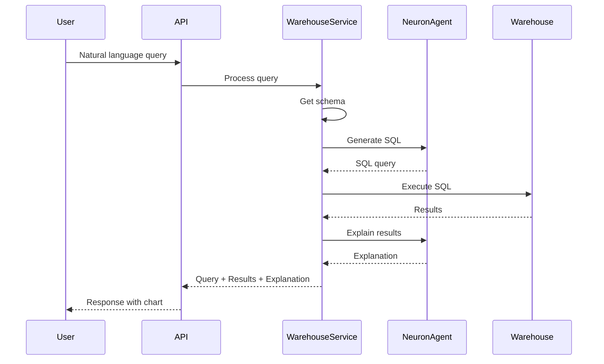

# 💬 Data Warehouse Q&A

<div align="center">

**Ask natural language questions about your data warehouse**

[← Semantic Search](semantic-search.md) • [Support Memory →](support-memory.md)

</div>

---

## 📋 Table of Contents

- [Overview](#overview)
- [How It Works](#how-it-works)
- [Getting Started](#getting-started)
- [Schema Management](#schema-management)
- [Query Examples](#query-examples)
- [Best Practices](#best-practices)

---

## 🎯 Overview

Data Warehouse Q&A allows you to ask natural language questions about your data warehouse and receive SQL queries, results, and explanations.

### Key Features

- 💬 **Natural Language to SQL** - Convert questions to SQL
- 📊 **Query Execution** - Execute queries safely
- 📈 **Visualizations** - Automatic chart generation
- 📝 **Explanations** - Understand query results
- 📚 **Schema Discovery** - Automatic schema understanding

---

## 🔧 How It Works

### Process Flow



---

## 🚀 Getting Started

### 1. Create a Schema

```bash
curl -X POST http://localhost:8082/api/v1/warehouse/schemas \
  -H "Content-Type: application/json" \
  -H "Authorization: Bearer YOUR_API_KEY" \
  -d '{
    "name": "Sales Schema",
    "description": "Sales data schema",
    "schema_definition": {
      "tables": [
        {
          "name": "customers",
          "columns": [
            {"name": "id", "type": "integer"},
            {"name": "name", "type": "varchar"},
            {"name": "email", "type": "varchar"}
          ]
        }
      ]
    }
  }'
```

### 2. Ask a Question

```bash
curl -X POST http://localhost:8082/api/v1/warehouse/query \
  -H "Content-Type: application/json" \
  -H "Authorization: Bearer YOUR_API_KEY" \
  -d '{
    "query": "What are the top 10 customers by revenue?",
    "schema_id": "your-schema-id"
  }'
```

---

## 📚 Schema Management

### Schema Discovery

Automatically discover schemas from your warehouse:

```bash
curl -X POST http://localhost:8082/api/v1/warehouse/schemas \
  -H "Content-Type: application/json" \
  -H "Authorization: Bearer YOUR_API_KEY" \
  -d '{
    "name": "Auto-discovered Schema",
    "discover": true,
    "connection_string": "postgresql://..."
  }'
```

### Schema Definition Format

```json
{
  "tables": [
    {
      "name": "customers",
      "description": "Customer information",
      "columns": [
        {
          "name": "id",
          "type": "integer",
          "description": "Customer ID",
          "primary_key": true
        },
        {
          "name": "name",
          "type": "varchar(255)",
          "description": "Customer name"
        }
      ]
    }
  ]
}
```

---

## 💬 Query Examples

### Example 1: Top Customers

**Query:** "What are the top 10 customers by revenue?"

**Generated SQL:**
```sql
SELECT 
    c.name,
    SUM(o.total) as revenue
FROM customers c
JOIN orders o ON c.id = o.customer_id
GROUP BY c.id, c.name
ORDER BY revenue DESC
LIMIT 10;
```

### Example 2: Time Series

**Query:** "Show me monthly sales for the last 6 months"

**Generated SQL:**
```sql
SELECT 
    DATE_TRUNC('month', order_date) as month,
    SUM(total) as sales
FROM orders
WHERE order_date >= NOW() - INTERVAL '6 months'
GROUP BY month
ORDER BY month;
```

---

## 💡 Best Practices

### Schema Design

- Provide detailed **descriptions** for tables and columns
- Include **relationships** between tables
- Document **data types** accurately

### Query Optimization

- Use **schema_id** to focus queries
- Provide **context** in natural language queries
- Review generated SQL before execution

### Security

- Use **read-only** database connections
- Implement **query validation**
- Set **timeout limits** for queries

---

## 📚 Related Documentation

- [API Endpoints](../api/endpoints.md) - Complete API reference
- [Tutorial: Warehouse Q&A](../tutorials/warehouse-qa-tutorial.md) - Step-by-step guide
- [Architecture: Data Flow](../architecture/data-flow.md) - How it works

---

<div align="center">

[← Back to Features](../README.md) • [Next: Support Memory →](support-memory.md)

</div>
